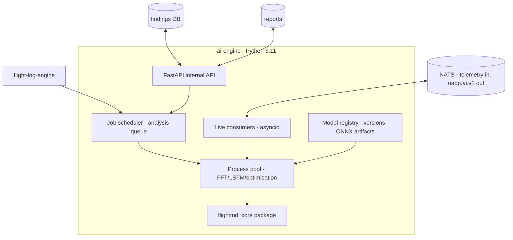

# AI_ENGINE

**Version 0.1.0 · 2026-07-03 · Phase 2. Python/FastAPI service. Constitutional constraint: advisory-only (ADR-0012), enforced structurally. Consumes `flightmd_core` (ADR-0014).**

## 1. Purpose

Turn telemetry and logs into **scored, explained, envelope-safe advisories**: post-flight diagnostics, live oscillation/anomaly detection, PID recommendations, predictive maintenance. Never a control element; the assurance argument covers the gate, not the model — that is the entire certification strategy for AI in this platform.

## 2. Module inventory

### 2.1 Post-flight analysis (from `flightmd_core` — production-hardened by FlightMD users)
Seven analyzers against ULog/DataFlash: **oscillation** (FFT, scipy; SEVERE > 0.70 normalized amplitude in 2–10 Hz, MODERATE > 0.45, MILD > 0.25), **vibration** (per-axis RMS + clip counts; > 60 m/s² CRITICAL, 30–60 WARNING; multi-IMU consistency), **EKF health** (innovation test ratios, fault-flag bitmask decode, spike detection > 1.0), **battery** (sag vs load, capacity fade, C-rate, temp stress), **GPS** (fix timeline, sat drops, HDOP trend, jamming indicator > 180 CRITICAL, spoofing state 4 = CRITICAL), **parameter anomaly** (defaults diff, safe-range check, dangerous combinations), **motor/ESC** (balance index, temps, current imbalance, RPM dropouts). Weighted health score (oscillation/vibration/EKF 20% each; battery/GPS 15%; params/motors 5%) with stacking penalties (CRITICAL −30, WARNING −15, INFO −5, floor 0). Output: `FlightMDReport` schema v1.0 — the frozen cross-project contract.

### 2.2 Live analysis (UAOP-native)
Streaming FFT oscillation detection on rate telemetry (windowed, per axis — shared implementation with the tuning engine's frequency view); LSTM autoencoder anomaly scoring on multi-channel windows (trained on normal SITL + accumulated fleet-normal data; output: score 0–1, affected channels, probable-cause lookup); threshold advisories published as `uaop.ai.v1.<vehicle>.anomaly`.

### 2.3 PID optimisation
Ziegler–Nichols initialization from step-response identification + Bayesian optimisation over the *safe envelope only* (hard constraint at candidate generation). Output: candidate gains + confidence + expected-effect rationale → tuning engine flow.

### 2.4 Predictive maintenance
Motor bearing wear (ESC current-draw signatures), prop damage (vibration FFT signatures), battery health (sag-vs-capacity model over cycles), frame resonance drift, ESC thermal patterns. Trend-based findings with maintenance-window suggestions; twin divergence (DIGITAL_TWIN.md §3) joins as an input in Phase 3.

## 3. Architecture

CPU-bound work (FFT, LSTM inference, Bayesian iterations) runs in the process pool; the event loop never blocks. Edge inference uses ONNX-exported models (Jetson GPU where present; CPU fallback with measured, published latency).

## 4. Advisory discipline (every artifact, no exceptions)

Each finding/recommendation carries: `model_id` + `model_version` + training-data hash (registry-signed), confidence score, input-window reference (queryable evidence), plain-language explanation, and — where applicable — the envelope check result. Lifecycle events `ai.recommendation_{shown,applied,dismissed}` close the audit loop. Model updates deploy through the signed OTA path like any component; a model version change is visible in every subsequent artifact.

## 5. Subsystem template summary

- **Interfaces:** NATS (telemetry consume; `uaop.ai.v1.>` publish — **no `uaop.cmd.>` permission, enforced in NATS authz config**); internal FastAPI/gRPC for job control; Postgres findings; MinIO reports.
- **Dependencies:** NATS, PostgreSQL, MinIO, flight-log-engine, telemetry-engine history, `flightmd_core` (pinned version; air-gap Mode A — no network use).
- **Failure modes & recovery:** model regression after update (versioned artifacts → rollback is an OTA rollback; findings always carry the version that produced them); analysis crash on pathological log (per-job isolation — one bad log kills one job, edge cases per FlightMD's hardened handling: short flights reduce confidence 30%, missing topics skip analyzers gracefully, corrupt files rejected with reasons); queue backlog under fleet load (advisory tier sheds first per the degradation ladder — a delayed advisory is fine, that's what advisory means); LSTM false-positive storms (per-vehicle alert budgets + hysteresis; sustained storm = model quarantine + advisory quality event).
- **Security:** models are signed artifacts (a poisoned model is an integrity attack — registry verifies provenance); training pipelines run offline, never on the edge node; findings DB is RBAC-read.
- **Scalability:** stateless workers over the queue — scale pool size on edge, worker replicas in cloud; live consumers partition by vehicle.

## 6. Honest limits (stated so nobody oversells them)

Anomaly models are only as good as their normal-data corpus — early deployments will lean on the deterministic analyzers (FFT, thresholds, rules) which are explainable and testable; the LSTM tier earns trust gradually with measured precision/recall published per release. No online learning on operational nodes, ever — model changes arrive only through the signed update path. Claude-assisted natural-language explanations (the FlightMD pattern) are cloud-optional: air-gap deployments get template-based explanations; the analysis itself never depends on any external API.
