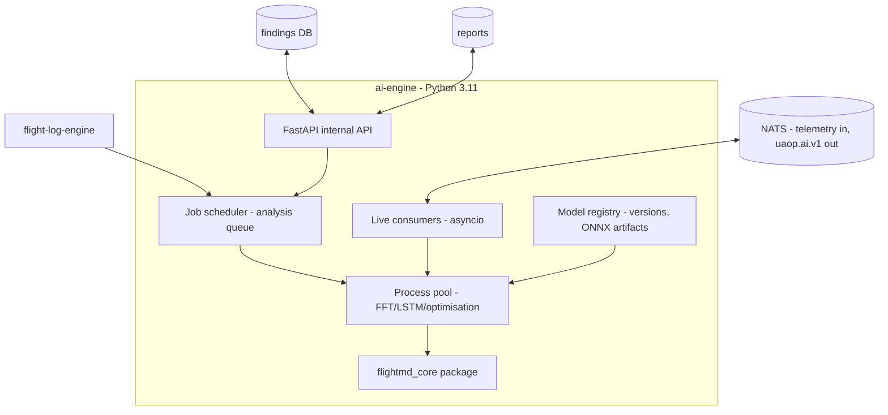

# AI_ENGINE

**Version 0.1.1 · 2026-07-07 · Phase 2. Python/FastAPI service. Constitutional constraint: advisory-only (ADR-0012), enforced structurally. Consumes `flightmd_core` (ADR-0014, amended ADR-0018).**

**Changelog:** v0.1.1 corrects §2.1 against the real, now-live `flightmd_core` v1.0.0 (previously described from the original project plan, not the shipped package) — see Review R4 / ADR-0018 in [DECISIONS.md](../00_Project_Foundation/DECISIONS.md).

## 1. Purpose

Turn telemetry and logs into **scored, explained, envelope-safe advisories**: post-flight diagnostics, live oscillation/anomaly detection, PID recommendations, predictive maintenance. Never a control element; the assurance argument covers the gate, not the model — that is the entire certification strategy for AI in this platform.

## 2. Module inventory

### 2.1 Post-flight analysis (from `flightmd_core` v1.0.0 — real, live, independently shipped)

**flightmd_core is production software, not a plan.** It is live at [github.com/Praddyx15/FlightMD](https://github.com/Praddyx15/FlightMD) (MIT), deployed at flightmd.vercel.app / flightmd-api.onrender.com, and validated against 50 real-world PX4 logs spanning 11 vehicle types (quad/hex/octorotor, fixed-wing, VTOL variants, ground rover, helicopters — sourced from PX4's public Flight Review database). What follows is corrected against the real package, not the original plan.

**Seven weighted analyzers** against **PX4 ULog, ArduPilot DataFlash (`.bin`), and MAVLink telemetry logs (`.tlog`) — format auto-detected** (exceeds the original two-format assumption): **oscillation** (FFT, scipy; CRITICAL > 0.70 normalized amplitude in 2–10 Hz, WARNING > 0.45, INFO > 0.25), **vibration** (per-axis RMS + clip counts; > 60 m/s² CRITICAL, 30–60 WARNING; multi-IMU consistency), **EKF health** (innovation test ratios, fault-flag bitmask decode, spike detection > 1.0), **battery** (sag vs load, capacity fade, C-rate, temp stress), **GPS** (fix timeline, sat drops, HDOP trend, jamming indicator > 180 CRITICAL, spoofing state 4 = CRITICAL), **parameter anomaly** (defaults diff, safe-range check, dangerous combinations), **motor/ESC** (balance index, temps, current imbalance, RPM dropouts). Weighted health score (oscillation/vibration/EKF 20% each; battery/GPS 15% each; params/motors 5% each) with stacking penalties (CRITICAL −30, WARNING −15, INFO −5, floor 0).

**Eighth analyzer, unweighted:** **ascent & recovery** (apogee detection, high-G launch profile, parachute-deployment signature) — built for sounding rockets/HABs sharing the PX4/ArduPilot/MAVLink telemetry stack. **UAOP has no rocket/HAB vehicle profile**, so the ai-engine integration wrapper filters `Category.ASCENT_PROFILE` findings out of the UAOP-facing report rather than showing operators diagnostics for a vehicle class the platform doesn't support (Review R4/F26) — this is a filter at the integration boundary, not a modification to `flightmd_core` itself (ADR-0001 adapter discipline).

**The engine is fully deterministic — zero ML, zero network calls in the base path.** Every threshold above is a fixed rule; the same log always produces the same report. Output: `FlightMDReport` schema **v1.5** (not v1.0 — the schema has evolved; UAOP's integration checks this field at every call, ADR-0009-style additive discipline applies here too).

**AI enhancement is optional and, in UAOP, off by default.** `flightmd_core` can accept an `AIEnhancer` (Groq free-tier by default upstream, Anthropic Claude optional) purely to polish the prose of the executive summary and per-finding explanations — it **never** changes a finding, a severity, or a score; those come entirely from the deterministic rules above. UAOP's Mode A integration passes **no `AIEnhancer`** by default: this keeps the entire post-flight analysis path at zero network calls, satisfying UAOP-NFR-001 (air-gap) and SECURITY.md's flight-data-confidentiality asset without any special-casing. An org may explicitly opt in to an Anthropic-backed `AIEnhancer` for polished prose when the node has connectivity and consents to sending flight-summary text off-node (Review R4/F29) — this is a per-org setting, never a platform default.

### 2.2 Live analysis (UAOP-native)
Streaming FFT oscillation detection on rate telemetry (windowed, per axis — shared implementation with the tuning engine's frequency view); LSTM autoencoder anomaly scoring on multi-channel windows (trained on normal SITL + accumulated fleet-normal data; output: score 0–1, affected channels, probable-cause lookup); threshold advisories published as `uaop.ai.v1.<vehicle>.anomaly`.

### 2.3 PID optimisation
Ziegler–Nichols initialization from step-response identification + Bayesian optimisation over the *safe envelope only* (hard constraint at candidate generation). Output: candidate gains + confidence + expected-effect rationale → tuning engine flow.

### 2.4 Predictive maintenance
Motor bearing wear (ESC current-draw signatures), prop damage (vibration FFT signatures), battery health (sag-vs-capacity model over cycles), frame resonance drift, ESC thermal patterns. Trend-based findings with maintenance-window suggestions; twin divergence (DIGITAL_TWIN.md §3) joins as an input in Phase 3.

## 3. Architecture

CPU-bound work (FFT, LSTM inference, Bayesian iterations) runs in the process pool; the event loop never blocks. Edge inference uses ONNX-exported models (Jetson GPU where present; CPU fallback with measured, published latency).

## 4. Advisory discipline (every artifact, no exceptions)

Each finding/recommendation carries: `model_id` + `model_version` + training-data hash (registry-signed), confidence score, input-window reference (queryable evidence), plain-language explanation, and — where applicable — the envelope check result. Lifecycle events `ai.recommendation_{shown,applied,dismissed}` close the audit loop. Model updates deploy through the signed OTA path like any component; a model version change is visible in every subsequent artifact.

## 5. Subsystem template summary

- **Interfaces:** NATS (telemetry consume; `uaop.ai.v1.>` publish — **no `uaop.cmd.>` permission, enforced in NATS authz config**); internal FastAPI/gRPC for job control; Postgres findings; MinIO reports.
- **Dependencies:** NATS, PostgreSQL, MinIO, flight-log-engine, telemetry-engine history, `flightmd_core>=1.0.0` (pinned to a specific commit of github.com/Praddyx15/FlightMD until published to PyPI; air-gap Mode A — no `AIEnhancer` passed, no network use).
- **Failure modes & recovery:** model regression after update (versioned artifacts → rollback is an OTA rollback; findings always carry the version that produced them); analysis crash on pathological log (per-job isolation — one bad log kills one job, edge cases per FlightMD's hardened handling: short flights reduce confidence 30%, missing topics skip analyzers gracefully, corrupt files rejected with reasons); queue backlog under fleet load (advisory tier sheds first per the degradation ladder — a delayed advisory is fine, that's what advisory means); LSTM false-positive storms (per-vehicle alert budgets + hysteresis; sustained storm = model quarantine + advisory quality event).
- **Security:** models are signed artifacts (a poisoned model is an integrity attack — registry verifies provenance); training pipelines run offline, never on the edge node; findings DB is RBAC-read.
- **Scalability:** stateless workers over the queue — scale pool size on edge, worker replicas in cloud; live consumers partition by vehicle.

## 6. Honest limits (stated so nobody oversells them)

**The boundary between §2.1 and §2.2–2.4 is now crisp and worth restating:** `flightmd_core` (§2.1) contributes zero machine learning — it is entirely deterministic rule engines, independently validated against 50 real flights. The **LSTM anomaly autoencoder, live streaming FFT, and Bayesian PID optimiser (§2.2–2.3) are 100% UAOP-native** — nothing in `flightmd_core` provides live/streaming analysis or ML-based anomaly scoring. Anomaly models are only as good as their normal-data corpus — early deployments will lean on the deterministic analyzers (both the UAOP-native FFT/threshold rules and the imported `flightmd_core` rule set, both explainable and testable) while the LSTM tier earns trust gradually with measured precision/recall published per release. No online learning on operational nodes, ever — model changes arrive only through the signed update path.

Natural-language polish (Groq or Claude, per §2.1) is cloud-optional **and disabled by default in UAOP**: air-gap deployments and any org that hasn't explicitly opted in get the deterministic rule engine's own plain-English text (`flightmd_core` generates this without any AI call — it is not a fallback, it's the base behavior); the diagnostic analysis itself never depends on any external API regardless of that setting.

**Boundary that matters for future maintainers (Review R4/F31):** UAOP imports only the `flightmd_core` Python package. It does not consume the FlightMD web API, frontend, or FlightMD's own fleet-operations features (per-airframe maintenance tracking, webhook alerts, cross-flight trends — these exist to serve FlightMD's own standalone, non-UAOP users). UAOP's [FLEET_MANAGEMENT.md](FLEET_MANAGEMENT.md) and [COMPLIANCE.md](../06_Compliance_and_Quality/COMPLIANCE.md) remain the sole authority for fleet and compliance concerns inside UAOP — the two projects share an analysis engine, not a fleet-ops stack.
