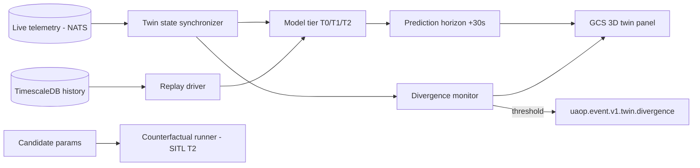

# DIGITAL_TWIN

**Version 0.1.0 · 2026-07-03 · Phase 3. Hosted by simulation-engine (TwinSession aggregate). Requirement: UAOP-HLR-051.**

## 1. What "digital twin" means here — scoped honestly

Marketing uses "digital twin" for everything; we mean three concrete, testable capabilities:

1. **Live mirror** — a synchronized model of the flying vehicle (state, mission progress, resource levels) rendered in 3D beside/instead of the map view, with **measured divergence** between mirror prediction and actual telemetry displayed, not hidden.
2. **Short-horizon prediction** — +30 s trajectory projection from current state + active mission + wind estimate, with confidence decay visualized.
3. **Replay & counterfactual** — re-fly recorded telemetry against the twin; optionally re-simulate segments with modified parameters ("would the new PID set have damped that oscillation?") using the SITL substrate.

Explicitly **not** claimed: high-fidelity aerodynamic identity with the physical airframe. The twin's fidelity is *stated per model tier* (below) — an honest twin with error bars beats an impressive twin with none.

## 2. Model tiers

| Tier | Model | Source | Use |
|---|---|---|---|
| T0 | Kinematic dead-reckoning + mission intent | telemetry only | live mirror, prediction baseline — works for any vehicle, zero setup |
| T1 | Parametric dynamics (mass, drag, thrust curves from vehicle config + logged behavior) | Tab-17-class vehicle config + log fitting | better prediction, battery/energy forecasting |
| T2 | Full SITL-in-loop twin (same airframe model as simulation) | simulation stack | counterfactual replay, failure re-analysis |

Sessions declare their tier; every rendered prediction carries tier + divergence stats. T1 parameter fitting is an ai-engine job (advisory, versioned like every model — ADR-0012 discipline applies to twin-fitted parameters too).

## 3. Data flow

The divergence monitor is the twin's most valuable output: sustained divergence between a fitted model and the live aircraft is an early-warning signal (thrust degradation, added payload mass, wind model failure) that feeds predictive-maintenance findings in ai-engine.

## 4. Subsystem template

- **Interfaces:** gRPC TwinSession API (start/stop/tier/replay/counterfactual); consumes telemetry subjects; publishes `uaop.event.v1.twin.*`; 3D state stream to GCS over the ordinary WebSocket surface (a twin is just another subscribable stream type).
- **Dependencies:** telemetry-engine (history), simulation-engine substrate (T2), vehicle config (parameter-engine), ai-engine (T1 fitting).
- **Failure modes:** twin lag behind live (render freezes at last sync + STALE banner — never extrapolate silently as if live); T2 SITL divergence from reality exceeding declared envelope (counterfactual results stamped LOW CONFIDENCE); replay/live mode confusion (**hard UI separation** — replay sessions are visually distinct globally, same watermark discipline as sim, because an operator commanding a replayed "aircraft" is the nightmare scenario; command surfaces are disabled wholesale in replay contexts).
- **Recovery:** sessions are projections — restart and resync from stream + history within seconds.
- **Security:** counterfactual runs with modified parameters execute only in the sim substrate; there is no path from twin to vehicle (no `uaop.cmd.>` permission, same wall as ai-engine).
- **Scalability:** T0/T1 are cheap (per-vehicle streams); T2 counts as a sim workload in the degradation ladder. Fleet-wide twins (Phase 4 cloud, downsampled) reuse T0 only.

## 5. Rendering

GCS 3D panel: vehicle attitude/position in a terrain context (offline elevation data — DTED/SRTM per MapConfig future fields), actual track vs predicted ribbon, divergence panel (position XY/Z, attitude, velocity, heading, battery — the deviation set from the Tab-21 functional spec). Cesium was the web-era choice; the Qt GCS uses a native 3D scene (Qt Quick 3D) fed by the same twin stream — evaluate in the Phase 3 UI spike whether terrain tiling needs a dedicated component (tracked with OQ-3's map spike, same offline-data family).

## 6. Why this earns its place (and when it doesn't)

The twin is deliberately Phase 3: it *consumes* a mature telemetry pipeline, vehicle config, simulation substrate, and history store. Attempting it earlier produces a demo, not an instrument. Conversely, once those exist, T0 is nearly free and T2 is mostly orchestration — the architecture pays for the feature. If Phase 3 scheduling tightens, T2 counterfactuals are the cut line; the live mirror + divergence monitor are the operationally valuable core.
