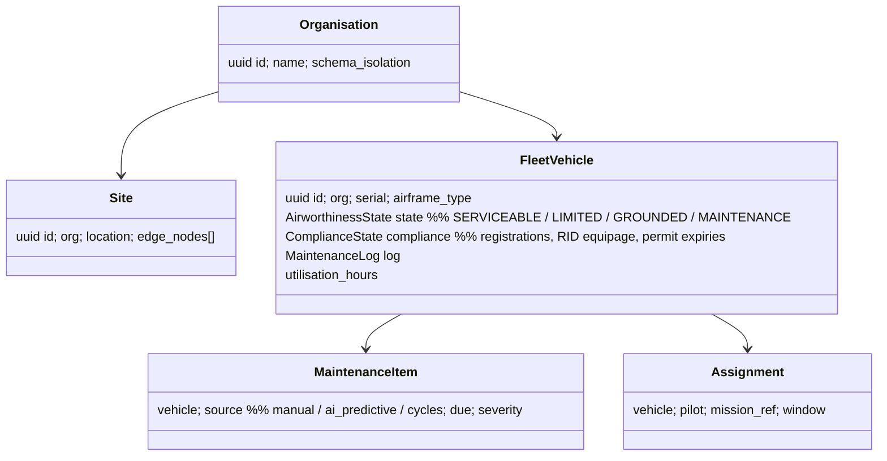

# FLEET_MANAGEMENT

**Version 0.1.0 · 2026-07-03 · Phase 4 engine (edge-local multi-vehicle views exist from Phase 1 via vehicle-manager; this engine adds the organisational layer). Requirements: UAOP-HLR-070/071/072.**

## 1. Purpose

Answer the fleet manager's (P4) governing question — *which aircraft can fly today, and why not the others?* — across vehicles, sites, and organisations, with command authority that respects RBAC and the edge-autonomy invariant: fleet tooling **observes and administers; it does not fly aircraft** (cloud-command exclusion, CLOUD_ARCHITECTURE.md §7).

## 2. Two-tier reality

| Tier | Scope | Backing |
|---|---|---|
| **Edge fleet view** (Phase 1+) | All vehicles on one node — status cards, per-vehicle RTL/VIEW under local authority | vehicle-manager projections + `TelemetrySnapshot` — no fleet-management service needed |
| **Enterprise fleet** (Phase 4) | Cross-node, cross-site, org hierarchy, maintenance, assignment, utilisation | fleet-management service (edge-resident for local ops, cloud instance for aggregates over synced data) |

This split keeps Phase 1 honest (multi-vehicle ops without enterprise machinery) and gives Phase 4 a clean seam.

## 3. Domain model

**AirworthinessState is the keystone.** It aggregates: open CRITICAL maintenance items, compliance expiries (registration, permits — BVLOS permit tracking from the Tab-20 functional spec), AI predictive-maintenance findings above threshold (advisory inputs to a human state change — a model never grounds an aircraft, a maintenance officer does, and the audit log shows both the advice and the decision), and manual grounding. A vehicle not SERVICEABLE cannot pass the pre-flight AUTHORISE gate (compliance-engine consults fleet state when the service is deployed).

## 4. Capabilities (Phase 4 scope)

Fleet dashboard (per-vehicle cards: state, position age, battery, pilot, mission — fed by `TelemetrySnapshot` sync); utilisation and availability analytics; maintenance scheduling with AI-predictive intake; assignment management (pilot currency/licence expiry warnings); compliance roll-up per vehicle (what expires this month, fleet-wide); cross-site views with per-edge `last_sync` honesty (CLOUD_ARCHITECTURE.md §3); RBAC-scoped actions (FLEET_MANAGER administers; PILOT sees assignments; OBSERVER reads).

## 5. Subsystem template summary

- **Interfaces:** gRPC/REST fleet API via gateway (edge) and cloud gateway; consumes vehicle events + snapshots; publishes `uaop.event.v1.fleet.*` (state changes, groundings — audit-critical); Postgres (org-schema-isolated in cloud).
- **Dependencies:** vehicle-manager projections, compliance-engine (expiry data, audit), ai-engine (predictive intake), sync-service (cloud tier), org/auth-service (RBAC).
- **Failure modes & recovery:** stale cross-site data (rendered with sync-age, never as live — structural honesty); conflicting airworthiness edits across edge/cloud (edge wins for its own vehicles — the site with the aircraft has the truth; conflict logged for review); fleet service down (zero impact on flying — edge fleet view is vehicle-manager's, and AUTHORISE gates fall back to local compliance data with an explicit FLEET-DATA-UNAVAILABLE annotation on the sign-off).
- **Security:** grounding/state changes are audited with actor identity; org isolation per CLOUD_ARCHITECTURE.md §4; fleet views expose position data — OBSERVER role scoping matters for defense customers (need-to-know per org unit is a Phase 4 hardening item).
- **Scalability:** cloud aggregates are projections over synced events — rebuildable, horizontally scalable; 255 vehicles/node × N nodes is comfortably relational-scale.

## 6. Deliberate modesty

No route optimisation, no automated tasking, no charging-infrastructure orchestration in v1 of this engine — those are products in themselves and arrive, if ever, as plugins or partner integrations on the fleet API. The engine's v1 job is *truthful fleet state with governed authority*, which is what every buyer audit actually checks.
