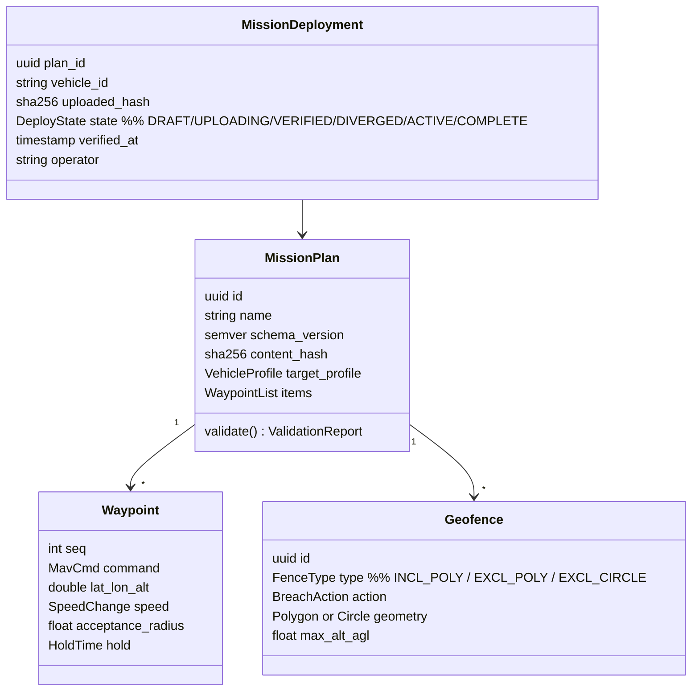

# MISSION_ENGINE

**Version 0.1.0 · 2026-07-03 · Phase 1 core engine. Requirements: UAOP-HLR-010/011/012. Catalog entry: MICROSERVICES.md.**

## 1. Purpose

Own the full mission lifecycle — authoring, validation, verified transfer, in-flight progress, geofencing — such that **what the operator approved is provably what the aircraft is flying** (the mission hash is the compliance identity).

## 2. Domain model

Plans are immutable once deployed — edits create versions. `MissionDeployment` is the per-vehicle projection tying plan hash to a physical upload event.

## 3. Validation pipeline (runs before any upload is possible)

1. **Structural:** sequence integrity, first/last item rules (takeoff/land/RTL semantics per stack), item-count vs FC capability probe.
2. **Dialect:** every item checked against the target stack's accepted-command table (MAVLINK_INTEGRATION.md §2) — unsupported items are itemized refusals with reasons, at edit time, not upload time.
3. **Geometric:** self-intersection, geofence containment (all path segments inside inclusion fences, outside exclusions, including turn-radius allowance for fixed-wing), terrain clearance where elevation data is loaded (advisory when absent — absence stated, never assumed flat).
4. **Energetic:** distance/time/climb estimate vs battery model (advisory tier — feeds from vehicle config; conservative defaults otherwise).
5. **Regulatory overlay:** plan vs airspace zones (DAM/LAANC/U-Space data when loaded) — violations block AUTHORISE FLIGHT via compliance-engine, not silently.

A plan carries its `ValidationReport`; a plan with ERROR-level findings cannot enter UPLOADING. WARN-level requires operator acknowledgment (logged).

## 4. Verified transfer (the signature behavior — UAOP-HLR-010/012)

Sequence in SYSTEM_ARCHITECTURE.md §4.2. Contract restated: upload → full download → byte-level comparison against the plan's canonical MAVLink encoding → only then `VERIFIED` + `mission.uploaded` audit event with hash. Timeout/partial anywhere → explicit failure + FC mission state re-read. **There is no code path to a silent "probably fine."** Periodic re-verify (and on reconnect) detects FC-side divergence (someone edited via another GCS) → `DIVERGED` state + alarm; flying a DIVERGED mission requires explicit acknowledgment.

## 5. In-flight projection

Consumes MISSION_CURRENT + position telemetry → progress model (current leg, ETA per remaining waypoint, cross-track error) published as `mission.progress` events for UI and fleet views. Pure projection — recomputable from stream at any time, holds no authority.

## 6. Geofence subsystem

Fences are first-class, versioned, hash-identified like plans. Upload path uses the fence protocol per stack; breach **execution** belongs to the FC (we configure the action: RTL/LAND/LOITER/HOLD/REPORT); UAOP's role is configuration integrity + breach event capture into the audit chain (choreography in EVENT_FLOW.md §6). Airspace data sources (FAA/DGCA DAM/OpenAIP imports) load as read-only overlay layers with import provenance recorded — regulatory zones and operator fences never mix identities.

## 7. Subsystem template summary

- **Interfaces:** gRPC MissionService (via gateway; REST map in API_SPECIFICATION.md §3); bridge MissionTransfer client; events `uaop.event.v1.mission.* / geofence.*`; Postgres (plans, versions, deployments).
- **Dependencies:** mavlink-bridge, vehicle-manager (authority + state), compliance-engine (audit), NATS, PostgreSQL. Elevation/airspace data optional by design.
- **Failure modes & recovery:** partial transfer (§4 — no ambiguity by construction); dialect gaps (validation-time refusal); DB loss (plans are the asset — Postgres PVC + backup policy per DATABASE.md; deployments reconstructible from audit + FC read-back); concurrent edits to one plan (optimistic versioning, second writer gets CONFLICT).
- **Security:** uploads require vehicle authority + durable audit-event persistence (fail-closed at JetStream per ADR-0015); geofence writes are HIGH-risk (confirmation flow per UX_GUIDELINES.md); plan library respects RBAC (a PILOT deploys, an OBSERVER reads).
- **Scalability:** stateless service over Postgres; concurrent per-vehicle transfers are independent; plan library growth is boring relational scale. Survey-pattern generators and corridor tools arrive later as mission item providers (PLUGIN_SYSTEM.md) — the engine's validator API is already the extension seam.
