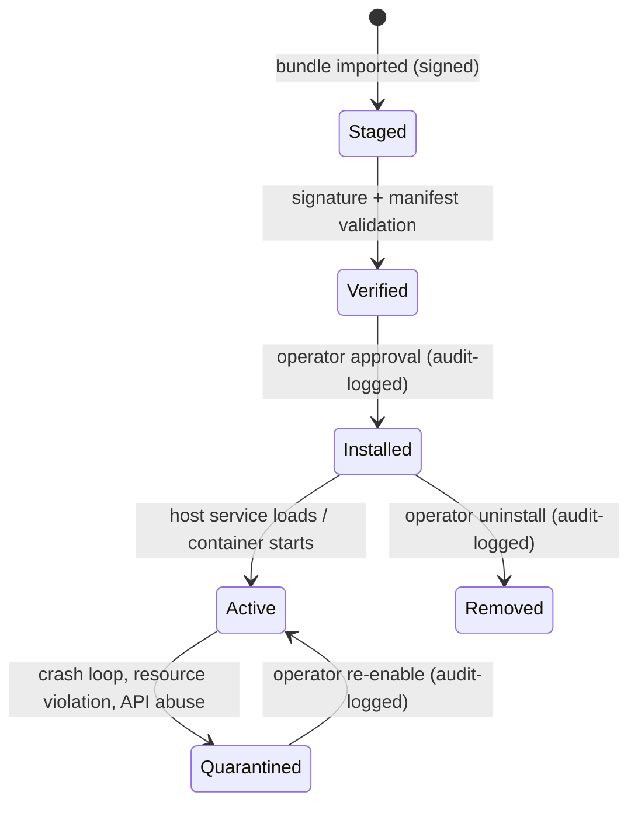

# PLUGIN_SYSTEM

**Version 0.1.0 · 2026-07-03 · Plugin-first is a constitutional principle; full SDK ships Phase 4, but interfaces are shaped from Phase 1 so plugins are never a retrofit.**

## 1. Purpose

Let third parties (and ourselves) extend UAOP — new analyzers, protocol adapters, UI panels, compliance jurisdictions, mission item types — without touching core services, and **without being able to hurt the platform**. In an aerospace-adjacent product, the second clause dominates the design.

## 2. Extension point taxonomy

| Type | Host | Runs as | Examples | Phase |
|---|---|---|---|---|
| Analyzer plugin | ai-engine | Sandboxed subprocess (Python) | Custom log analyzer, payload-specific health model | 2 (internal), 4 (SDK) |
| Protocol adapter | middleware tier | Own container (C++/any) | New telemetry radio, DJI/FPV if OQ-1 approves | 4 |
| UI panel | Qt GCS | QML module, in-process but capability-restricted API | Payload control panel, custom instrument | 4 |
| Compliance pack | compliance-engine | Data + sandboxed calculators | New jurisdiction rules, checklist templates | 3 (data packs), 4 (logic) |
| Mission item provider | mission-engine | Sandboxed validator + data | Survey pattern generators | 4 |

## 3. Trust and sandboxing model

Principle: **a plugin is Zone 0 software until proven otherwise.**

1. **Signing:** every plugin bundle is signed; the node's trust store decides acceptance (org key for internal, UAOP marketplace key for distributed, customer key for private). Unsigned = refused, no dev-mode bypass on edge profiles (dev bypass exists only in workstation profile, loudly watermarked in UI).
2. **Manifest-declared capabilities:** a plugin declares subjects it subscribes to, APIs it calls, resources it needs. The runtime grants exactly that — capability tokens, not ambient authority.
3. **Process isolation:** analyzer/adapter/compliance plugins run out-of-process (subprocess or container) with cgroup CPU/memory limits and no network by default. UI plugins are the hard case (in-process QML): they get a restricted API object and **cannot** issue vehicle commands — command surfaces stay in core panels (same rationale as ADR-0012).
4. **Hard exclusions:** no plugin type can publish on `uaop.cmd.>`, write audit records, or touch another service's storage. Vehicle command extension is not a plugin capability, by design — it would put third-party code in the flight-influencing boundary.

## 4. Lifecycle

Quarantine is automatic and sticky: three crashes in ten minutes, sandbox limit breach, or a capability violation quarantines the plugin and raises an advisory. A quarantined plugin can never auto-restart.

## 5. Interfaces (stable contracts)

- **Analyzer contract** mirrors `flightmd_core`'s `BaseAnalyser` (name, required/optional topics, `analyse() → AnalyserResult`) — one contract for internal and external analyzers, already proven by FlightMD (ADR-0014).
- **Adapter contract:** implement `VehicleLink` (or `SensorSource`) gRPC service + publish canonical telemetry protobuf. The core never learns protocol details.
- **UI panel contract:** QML module + manifest; receives a scoped `PanelContext` (read-model subscriptions, settings storage, command *request* API that routes through core confirmation flows).
- **Versioning:** plugins pin `api_version`; hosts refuse incompatible plugins with a clear message. The plugin API is semver'd independently of the platform.

## 6. Failure modes & recovery

| Failure | Containment |
|---|---|
| Plugin crash | Out-of-process: host unaffected, restart policy then quarantine. UI plugin: QML engine guards, panel unloads, GCS survives |
| Resource runaway | cgroup kill → quarantine |
| Malicious/compromised plugin | Capability walls limit blast radius to declared scope; signing gives provenance; audit shows install/approval trail |
| API-breaking platform upgrade | Version negotiation refuses load; marketplace metadata flags incompatibilities before update |

## 7. Security considerations

Plugin bundles are the platform's largest deliberate attack surface. Mitigations beyond sandboxing: marketplace review (Phase 4), SBOM required in manifest, no plugin network egress without declared endpoints (enforced by netns policy), and plugin telemetry (crash/behavior) in observability. Threat model detail: SECURITY.md §plugins.

## 8. Scalability & future

The adapter type is how UAOP absorbs new ecosystems without core churn (dji-service/fpv-service, if approved, arrive this way). Marketplace backend (Phase 4) adds distribution, licensing hooks (OQ-4 shapes this), and compatibility metadata. Long term, compliance packs let regulatory updates ship as data, decoupled from platform releases — that's the difference between "update within days of a rule change" and "wait for v2.3".
