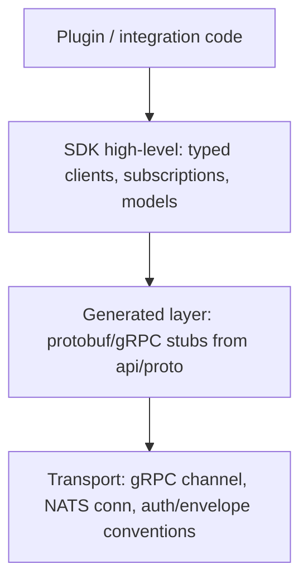

# SDK_DESIGN

**Version 0.1.0 · 2026-07-03 · The SDK is the productized face of the plugin system and the APIs. Ships Phase 4; contracts it wraps are stable from Phase 1 — that ordering is the whole strategy.**

## 1. What "SDK" means for UAOP

Three deliverables under one version:

1. **uaop-sdk-cpp** — C++ library: plugin base classes (adapter, analyzer host glue), canonical protobuf types, NATS/gRPC client helpers with the platform's auth and envelope conventions baked in.
2. **uaop-sdk-python** — Python package: analyzer contract (`BaseAnalyser`-compatible), typed models generated from the same protos, async client for gateway APIs. Target persona: research labs and data teams.
3. **uaop-cli** — developer tool: scaffold plugin projects, validate manifests, run the local sandbox harness, sign bundles, publish to a marketplace/private registry.

Non-goal: an SDK for building *vehicle command* extensions — excluded by the plugin trust model (PLUGIN_SYSTEM.md §3.4).

## 2. Design tenets

- **Contracts first, helpers second.** Everything the SDK does is possible with raw gRPC/NATS against `api/proto/`. The SDK removes boilerplate; it never holds private APIs. This keeps the SDK honest and the platform scriptable.
- **One analyzer contract everywhere.** `flightmd_core`'s analyzer shape is the SDK analyzer shape (ADR-0014). An analyzer written for FlightMD runs in UAOP unmodified; that's a real, demonstrable ecosystem story on day one of Phase 4.
- **The simulator is the dev loop.** `uaop-cli dev up` starts a workstation-profile stack with PX4 SITL; plugin authors develop against simulated vehicles identical (by design, DATA_FLOW.md §7) to real ones.
- **Semver discipline:** SDK major = plugin API major. Deprecations live one minor version with warnings before removal.

## 3. Developer journey (the product spec for the SDK)

```
uaop-cli new analyzer my-payload-health     # scaffold: manifest, contract stub, tests, CI file
uaop-cli dev up                             # local stack + SITL
uaop-cli test                               # runs analyzer against bundled sample logs + golden outputs
uaop-cli validate                           # manifest, capability, API-version checks (same code CI runs)
uaop-cli sign --key org.pem                 # bundle signing
uaop-cli publish --registry ...             # marketplace or private registry
```

If any step needs a wiki page to explain, the step is wrong. The CLI carries the workflow; docs explain concepts only.

## 4. API surface layering



The generated layer is regenerated per release from the same protos the platform builds against — SDK/platform drift is structurally impossible; a contract test in CI proves it (TESTING.md).

## 5. Failure modes & versioning safety

| Scenario | Behavior |
|---|---|
| SDK older than platform | Fine within major — additive contracts (ADR-0009) |
| SDK newer than platform | Client feature-detects via gateway version handshake; degraded features are explicit errors, not silent no-ops |
| Plugin built on deprecated API | Load-time warning during window, refusal after, with the exact migration pointer in the message |

## 6. Security

SDK ships with signing tooling but never private keys; sandbox harness replicates edge capability walls so "works locally, quarantined in production" cannot happen; published bundles require SBOM (generated by `uaop-cli`); the SDK's own supply chain is pinned and attested like any platform component (CI_CD.md).

## 7. Open dependency

Marketplace licensing/commercial terms depend on OQ-4 (open-core vs proprietary). SDK *technology* is unaffected — only distribution and license enforcement hooks change — so SDK work is not blocked on that decision.
