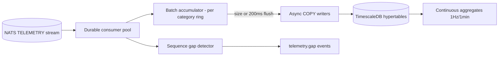

# TELEMETRY_ENGINE

**Version 0.1.0 · 2026-07-03 · Phase 1 core engine + the canonical telemetry contract (ADR-0009). Requirements: UAOP-HLR-030, UAOP-NFR-002/005.**

## 1. Purpose

The platform's memory: persist every telemetry sample at received fidelity, serve history queries, account for every gap, and generate the snapshot/delta forms other consumers need. The engine is deliberately **not** on the live-display path (gateway fans out directly from NATS) — persistence problems must be unable to add display latency (DATA_FLOW.md §3).

## 2. The canonical contract — `VehicleTelemetry` field census (frozen v1 scope)

Defined in `api/proto/telemetry/v1/`. Categories = NATS subject suffixes. proto3 optional semantics throughout: absent ≠ zero, and the UI renders absence as absence.

| Category | Fields |
|---|---|
| **position** | lat/lon (WGS84), alt WGS84 + AGL, fix type (incl. RTK_FLOAT/RTK_FIXED), sats, HDOP/VDOP/PDOP, ground speed, course over ground, GPS UTC ms. RTK block (optional): fix type, baseline length/heading, differential age, base station id, H/V accuracy |
| **attitude** | roll/pitch/yaw deg, rates deg/s, quaternion WXYZ |
| **velocity** | NED velocities, horizontal/vertical speed, airspeed, indicated airspeed |
| **imu** | accel XYZ m/s², gyro XYZ rad/s, mag XYZ gauss, temp, IMU instance id, vibration XYZ, clip counts |
| **ekf** | pos/vel/heading innovations, mag/baro/GPS innovations, fault flags (uint32 bitmask), innovation test ratios, terrain alt, wind N/E |
| **battery** | voltage, current, remaining %, capacity mAh, temp, cell count, per-cell voltages (≤14), battery id, fault flags, charge state |
| **esc** (repeated per motor) | index, RPM, voltage, current, temp, duty, failure flags |
| **rc** | 18 channel values, RSSI, count, signal-lost, failsafe-active, protocol |
| **link** | GCS link quality/latency/loss, data rate, C2 type (RADIO/LTE/SATELLITE), C2 quality/latency/loss |
| **rf** | GPS jamming indicator (0–255), spoofing state (UNKNOWN/NO/INDETERMINATE/SPOOFING), noise per ms, interference level, SNR |
| **health** | CPU, RAM, SD free, temp, 5V/3.3V rails, error count, SYS_STATUS bitmasks |
| **state** | armed, mode, autopilot/vehicle type, failsafe active+reason, landed state, home position, distance/bearing home, flight time, mission index, mission state |
| **remoteid** | UAS id, broadcast active, USS connected, last broadcast ts, emergency status |

Envelope on every message: vehicle_id, per-vehicle monotonic `sequence`, source timestamps (vehicle + bridge receive), `sim` flag. Companion messages: `TelemetrySnapshot` (fleet-card summary) and `TelemetryDelta` (changed-fields-only for constrained links) — both derived by this engine, same schema version.

## 3. Ingest pipeline

Engineering rules: writers use COPY/batched inserts sized to hit ≥ 1000 Hz single-vehicle IMU sustained (UAOP-HLR-030) on RC-3 hardware — a Phase 1 benchmark, not a hope; per-category hypertables (schema mirrors proto categories) partitioned by vehicle_id + time; backpressure sheds per the degradation ladder (history first, with `node.degradation` event), the consumer never blocks the stream for other durable consumers.

## 4. Query surface

gRPC `TelemetryQueryService`: time-range by vehicle/category/fields with server-side downsampling (`rate_hz` param → aggregate selection), event-window queries ("±60 s around this failsafe" — the pinned-window retention class), and export jobs (CSV/JSON/ULog-adjacent) as async operations. Query cost guards: range × rate limits with itemized refusal (ask for less, or run an export job) — an analyst cannot accidentally table-scan a month of 1 kHz IMU through the live API.

## 5. Gap accounting (the honesty mechanism)

Every per-vehicle sequence discontinuity → `telemetry.gap` event (vehicle, category, from_seq, to_seq, plausible cause: link loss vs shed vs restart). Gaps are queryable alongside data; any history chart in the GCS renders gap regions explicitly (UX_GUIDELINES.md). This single feature is what lets us say "the record is complete or the record says where it isn't" — the compliance posture depends on it.

## 6. Subsystem template summary

- **Interfaces:** NATS durable consumers (in); gRPC query API, gap events, snapshot/delta publications (out); TimescaleDB (owned exclusively).
- **Dependencies:** NATS, TimescaleDB. Nothing else — deliberately minimal for the criticality tier.
- **Failure modes & recovery:** DB stall → JetStream buffers + ladder shed (live unaffected, by architecture); engine crash → durable consumer resumes at ack floor, dedup on (vehicle, sequence) keys makes replay idempotent; disk pressure → retention ladder (DATA_FLOW.md §4) + watermark alarms; hypertable bloat → compression policies (older than 24 h) + aggregate serving for wide queries.
- **Security:** query API RBAC-scoped; exports audit-logged (who took what data); no direct SQL for anyone.
- **Scalability:** per-vehicle partitioning scales to fleet sizes; multi-node writers if a single edge ever hosts 50+ vehicles (Phase 3 target verified by benchmark); cloud tier consumes downsampled aggregates only (CLOUD_ARCHITECTURE.md §3).
