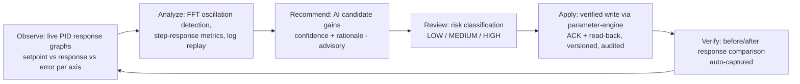

# TUNING_ENGINE

**Version 0.1.0 · 2026-07-03 · Phase 2. The "outperform Mission Planner in tuning depth" deliverable. Requirements: UAOP-HLR-022/023. Functionally hosted across parameter-engine (writes) + ai-engine (recommendations) + a tuning application service; this document owns the end-to-end design.**

## 1. Purpose

Give an integration engineer (P2) a tuning workflow that is **deeper than Mission Planner and safer than either incumbent**: live response visualization, log-replay analysis, AI-assisted recommendations — with a write path whose risk discipline makes hardware-destroying mistakes hard.

## 2. The tuning loop

Every arrow is a designed handoff, not a UI aspiration. The loop closes at F: after any tuning write, the engine captures a comparison window (same maneuver class before/after where available) so the operator sees measured effect, not vibes.

## 3. Capabilities

| Capability | Design |
|---|---|
| Live response graphs | Rate/attitude setpoint vs actual vs error per axis at ≥ 50 Hz from the attitude/imu categories; rendered in GCS oscilloscope panels (UI_GUIDELINES.md) |
| Frequency-domain view | Streaming FFT per axis (ai-engine oscillation detector run in live mode) — Bode-equivalent insight without requiring system-ID maneuvers |
| Log-replay tuning | Load a flight log (flight-log-engine) → same analysis suite offline → recommendations grounded in real flight data |
| Auto-PID assistance | Ziegler–Nichols initial estimate + Bayesian refinement (AI_ENGINE.md §4) — always envelope-constrained |
| Preset library | Conservative/Default/Sport/Aggressive/Racing/Fixed-wing/VTOL baseline sets per airframe class, versioned, each with provenance notes |
| Stack auto-tune orchestration | Trigger and monitor PX4/ArduPilot native autotune (their loops, our supervision + record) |
| Before/after comparison | Auto-captured response windows keyed to parameter version ids |

## 4. Risk-classified write path (the safety spine — UAOP-HLR-022)

Every candidate write is classified before the operator sees the Apply button:

| Class | Criteria (examples) | Flow |
|---|---|---|
| LOW | Within preset envelope, small delta (< 15%), non-flight-critical group | Apply → verified write |
| MEDIUM | Larger delta, rate-loop gains, in-envelope | Explicit confirmation with delta summary |
| HIGH | Near envelope edges, failsafe/geofence/EKF groups, or vehicle IN_FLIGHT | Typed acknowledgment + double audit entry; **refused in flight** unless override policy enabled (itself an audited configuration) |

Envelopes come from per-airframe safe-range metadata (parameter-engine packs, same data FlightMD's `param_safe_ranges.json` seeded). Server-side enforcement — the UI is a convenience, the engine is the wall. AI recommendations are **constrained to the envelope at generation time** (a recommendation the operator shouldn't apply must never be shown — ADR-0012 plus basic decency).

## 5. Subsystem template summary

- **Interfaces:** tuning gRPC surface via gateway (session start/stop, analysis on window/log, recommendation fetch, apply-with-class); consumes attitude/imu/ekf telemetry; writes exclusively through parameter-engine (no second write path — single point of validation/versioning/audit); events `uaop.ai.v1.*.tuning_recommendation`, `param.written`.
- **Dependencies:** parameter-engine, ai-engine, flight-log-engine, telemetry-engine (history windows), vehicle-manager (flight state for risk class).
- **Failure modes & recovery:** telemetry rate insufficient for FFT window (analysis refuses with minimum-rate message rather than producing garbage); recommendation on stale data (windows carry timestamps; > 60 s stale = regenerate); write applied but vehicle behavior degrades (the before/after capture + one-click **revert to previous version** via parameter-engine history — revert is itself a versioned, audited write); ai-engine down (manual tuning fully functional — AI is additive, never load-bearing).
- **Security:** the highest-consequence write surface in the platform; everything above plus rate-limiting on parameter writes per vehicle.
- **Scalability:** per-vehicle sessions; FFT/live analysis is bounded per session; heavy log analysis runs as ai-engine jobs off the interactive path.

## 6. Why this beats the incumbents (kept honest)

Mission Planner has deep ArduPilot tuning but no PX4, no risk classification, no live FFT, no versioned revert. QGC tunes PX4 shallowly. Neither closes the loop with measured before/after or grounds recommendations in envelope metadata. Our depth claim rests on the *loop*, not on any single screen — and it requires the Phase 1 parameter/telemetry substrate, which is why tuning is Phase 2 and not a demo hacked earlier.
