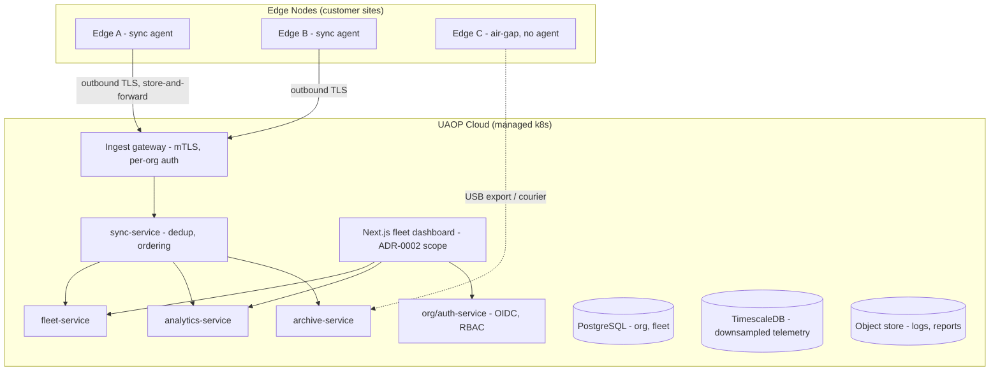

# CLOUD_ARCHITECTURE

**Version 0.1.0 · 2026-07-03 · Phase 4 tier. Nothing in this document may become a runtime dependency of flight operations (UAOP-NFR-001).**

## 1. Role

The cloud tier is an **amplifier**: aggregate what edges record, administer organisations, serve long-horizon analytics, archive compliance data. It holds no vehicle links, issues no vehicle commands in v1 of the tier (see §7), and its total absence must be invisible to a flying operation.

## 2. Topology

## 3. Synchronisation contract (the load-bearing design)

- **Direction:** edge→cloud is the primary flow. Cloud→edge carries only: signed update bundles, configuration *proposals* (operator-approved on edge), and org/RBAC data.
- **Transport:** outbound-only from edge (no inbound listeners on field networks); resumable, chunked, content-addressed transfers.
- **Semantics:** at-least-once with content hashes for dedup; per-stream ordering by edge-issued monotonic sequence. Cloud state is **eventually consistent and honest about it** — every fleet view shows per-edge `last_sync` age.
- **Data classes and sync policy:**

| Class | Policy |
|---|---|
| Audit chains | Full fidelity, verified against hash chain on ingest — a chain break quarantines the batch and alarms |
| Flight logs / reports | Full files to object store, content-addressed |
| Telemetry | Downsampled (1 Hz default) + full-rate windows around events (failsafe, breach); full-rate bulk only on explicit request |
| Vehicle/fleet metadata | Bidirectional merge, org-scoped, last-writer-wins with conflict log |

- **Air-gap parity:** the courier path (signed export bundle on removable media → archive-service import) uses the same envelope format and signature chain as network sync. One code path, two transports.

## 4. Multi-tenancy

Org-per-schema isolation in PostgreSQL (not row-level only): defense and enterprise buyers will ask where their data lives, and schema isolation gives a clean answer plus per-org export/purge. RBAC roles (PLATFORM_ADMIN, ORG_ADMIN, FLEET_MANAGER, PILOT, OBSERVER, MAINTENANCE) enforced in org-service and asserted in every service via signed claims. Cross-org queries exist only for PLATFORM_ADMIN operational metrics, never customer data.

## 5. Services (cloud-only additions)

| Service | Purpose | Notes |
|---|---|---|
| sync-service | Ingest, verify, dedup, route edge batches | The only writer of edge-originated data |
| fleet-service | Fleet aggregates, availability, maintenance state | Reads projections, no vehicle authority |
| analytics-service | Cross-flight trends, fleet health models | Batch; may train models later — deployment of models back to edge goes through the signed update path |
| archive-service | Long-term compliance archive, legal hold, export | WORM-style retention on audit data |
| org/auth-service | OIDC IdP federation, RBAC, licensing | Licensing enforcement is cloud-side for cloud features only — edge never phones home to keep flying (see BUSINESS_MODEL.md) |

## 6. Failure modes

| Failure | Effect | Recovery |
|---|---|---|
| Cloud fully down | Zero operational impact at edges; sync agents queue | Agents resume with backoff; queues bounded by edge disk watermarks |
| Sync corruption / partial batch | Quarantine batch, alarm, request re-send by sequence range | Content addressing makes re-send idempotent |
| Tenant data breach suspected | Schema isolation limits blast radius | Per-org key rotation, audit chain proves data integrity history |

## 7. Deliberate exclusion: cloud-originated vehicle command

Remote command from cloud (e.g., RTL from a fleet dashboard) is **excluded from tier v1**. It converts the cloud from amplifier to flight-influencing system — dragging the entire tier into the safety and security assurance boundary (authority checks, link-loss semantics, audit locality). If a customer requires it, it enters as its own project with its own safety case, not as a dashboard button. This exclusion is a design decision, recorded here so it is not "discovered" as a missing feature.
