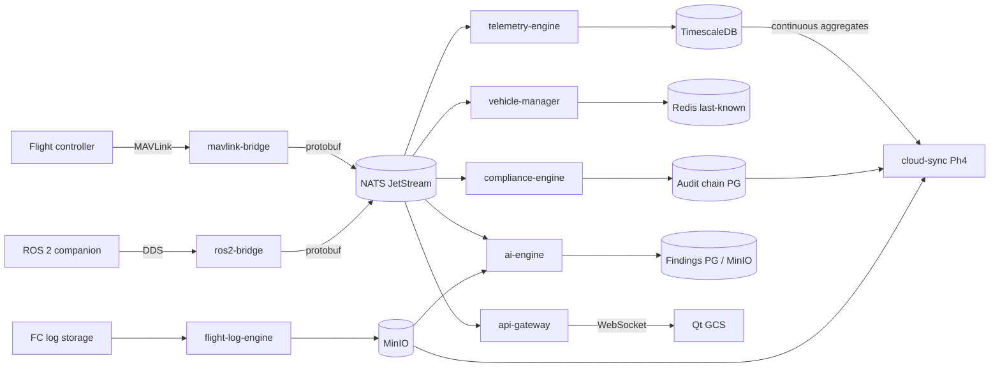

# DATA_FLOW

**Version 0.1.0 · 2026-07-03 · Where every byte originates, travels, rests, and dies. Event semantics: EVENT_FLOW.md.**

## 1. Data classes

| Class | Origin | Rate | Rest | Retention | Criticality |
|---|---|---|---|---|---|
| Live telemetry | FC via mavlink-bridge | 10–1000 Hz | TimescaleDB hypertables | Edge: policy-tiered (below) | High (live), Medium (history) |
| Flight logs (ULog/DataFlash) | FC storage / SITL | Per flight | MinIO (content-addressed) | Compliance-driven, effectively permanent | High — evidence |
| Audit events | Every mutating action | Low | Postgres append-only, hash-chained | Permanent | **Highest** |
| Missions/geofences | Operator | On edit | Postgres, versioned | Permanent (versions) | High |
| Parameter versions | Operator/FC | On write | Postgres | Permanent | High |
| AI artifacts | ai-engine | Per analysis | Postgres (findings) + MinIO (reports) | Policy | Advisory |
| Video | Payload RTSP | Continuous | Display-only Phase 1; optional MinIO recording Phase 3 | Policy | Medium |
| Config | Files + settings API | Rare | Files + Postgres | Versioned | High |
| Metrics/logs (ops) | All services | Continuous | Prometheus / log store | 15 d edge | Low |

## 2. Master flow

## 3. Hot path budget (UAOP-NFR-002: vehicle→UI ≤ 250 ms P95)

| Segment | Budget |
|---|---|
| Radio air-time + serial | 100 ms (outside our control; measured, not assumed) |
| bridge parse→publish | 5 ms |
| NATS delivery | 5 ms |
| gateway fan-out shaping | 20 ms |
| WebSocket + GCS model update + render coalesce | 60 ms |
| Margin | 60 ms |

Persistence is **off** the hot path: TimescaleDB writes are batched consumers; a DB stall can never add latency to the live stream (verified by the fault-injection suite, TESTING.md).

## 4. Telemetry retention ladder (edge)

1. **Full rate** (as received, up to 1000 Hz IMU): 72 h rolling window.
2. **Event-pinned full rate:** ±60 s around failsafe/breach/anomaly events — pinned exempt from eviction until synced or exported.
3. **1 Hz downsample (continuous aggregate):** 90 d.
4. **Flight summary rows:** permanent.

Disk watermarks (80%/90%) accelerate the ladder; audit and flight logs are never in the eviction domain (they block, alarm, and demand operator action instead — evidence doesn't quietly vanish).

## 5. Ownership and access matrix (excerpt — enforced by DB roles)

| Store | Writer | Readers |
|---|---|---|
| TimescaleDB telemetry | telemetry-engine only | gateway (query API), ai-engine, simulation-engine (replay) — via gRPC, not SQL |
| Audit tables | compliance-engine only (INSERT-only role) | compliance-engine query API |
| Mission tables | mission-engine | mission-engine API |
| Param versions | parameter-engine | parameter-engine API |
| MinIO buckets | per-service bucket policy (logs→flight-log-engine, reports→ai-engine) | scoped read policies |
| Redis | vehicle-manager (state), gateway (sessions) | keyspace-scoped |

Cross-service data access is **always by API/event, never by SQL** — the single most load-bearing rule for keeping services independently deployable.

## 6. Data integrity chain

Flight evidence integrity is end-to-end verifiable: MAVLink CRC (link) → bridge validation counters → JetStream persisted sequence (gap-detectable) → telemetry gap events (explicit loss) → hash-at-capture for logs → hash-chained audit for actions → chain verification on export/sync. At no stage can data be silently altered or silently lost; every loss mode has a counter, an event, or a chain break that proves it.

## 7. Cross-boundary flows

- **Edge→Cloud:** per CLOUD_ARCHITECTURE.md §3 (store-and-forward, class-based policy).
- **Edge→USS/UTM:** outbound HTTPS adapters in compliance-engine/remote-id; queue-and-defer when offline.
- **Edge→removable media:** signed export bundles (audit extracts, logs, reports) — same envelope as sync (one verifier).
- **Simulation:** SITL-sourced telemetry flows the identical pipeline tagged `sim=true` end-to-end; sim data can never masquerade as flight data (tag is in the protobuf envelope, checked by compliance-engine).
