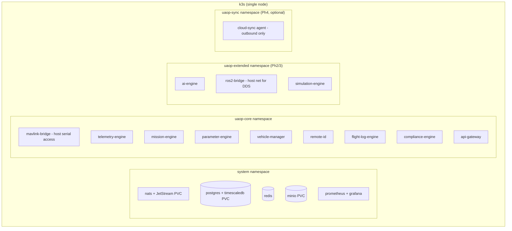

# EDGE_ARCHITECTURE

**Version 0.1.0 · 2026-07-03 · The Edge Node is the primary product. This document defines what runs on it, how it survives, and how it is updated.**

## 1. Definition

A **UAOP Edge Node** is a single compute unit (RC-2/RC-3 in HARDWARE_ARCHITECTURE.md) running the complete Phase-scoped service stack under k3s, physically near flight operations. Design axiom: **the node is autonomous** — internet, cloud, and even the GCS laptop may disappear without affecting ingestion, recording, supervision, or failsafe surfacing.

## 2. Node composition

Namespace = criticality tier. `uaop-core` has guaranteed resource classes and highest restart priority; `uaop-extended` is burstable; `uaop-sync` is best-effort and **may be entirely absent** (air-gap profile simply omits the namespace).

## 3. Resource budget (RC-3 Jetson Orin NX 16 GB, 1 vehicle — UAOP-NFR-003)

| Tier | CPU (of 8 cores) | RAM |
|---|---|---|
| Infrastructure (NATS/PG/Redis/MinIO/monitoring) | ≤ 1.5 | ≤ 1.5 GB |
| uaop-core (9 services) | ≤ 2.0 | ≤ 1.5 GB |
| uaop-extended | ≤ 1.5 (burst 3 for inference) | ≤ 1 GB |
| Headroom (soak-verified) | ≥ 3.0 | ≥ 4 GB free |

Enforced as k8s requests/limits; the Phase 2 exit gate includes a soak test proving the budget on reference hardware.

## 4. Degradation ladder (what sheds first)

Under resource pressure or partial failure, capabilities shed in strict reverse-criticality order — never the other way:

1. Cloud sync (uaop-sync)
2. AI inference / analysis jobs
3. Simulation workloads
4. Telemetry **history** persistence (live streaming and audit logging survive)
5. UI stream rate reduction (10 Hz → 2 Hz, explicit indication)
6. **Never shed:** MAVLink ingestion, vehicle-manager supervision, audit chain, failsafe surfacing

Each shed/restore transition is an event on `uaop.event.v1.node.degradation` and visible in the GCS system panel.

## 5. Offline operation (air-gap profile)

- All container images pre-loaded into k3s's embedded registry from a signed bundle — no pull-through, no registry dependency.
- Map tiles imported as offline packages (ADR-0008); `offlineMode: true` → zero network requests, verified by an egress-firewall test in CI.
- Regulatory functions run record-and-defer: Digital Sky / LAANC submissions queue locally with explicit "NOT SUBMITTED" status — the platform never fakes regulatory green.
- Time: NTP when available; GPS-disciplined fallback; monotonic sequence numbers protect audit ordering either way (HARDWARE_ARCHITECTURE.md §5).

## 6. Updates (OTA)

Signed, atomic, rollback-capable:

1. Update bundle = OCI images + Kustomize overlay + migration jobs, signed (Cosign) as one unit.
2. Delivered via cloud-sync when connected, or **USB import** in air-gap (same signature path — no unsigned side door).
3. Node verifies signature chain → stages images → applies overlay with `kubectl rollout`; health gates (readiness + smoke checks) must pass within a window or **automatic rollback** to the previous overlay.
4. DB migrations are forward-only with pre-migration snapshot; a failed migration restores the snapshot and rolls back images.
5. **Updates are refused while any vehicle is in flight state ARMED/IN_FLIGHT** (vehicle-manager veto).
6. Every update attempt (source, signature identity, result) is audit-logged.

## 7. Multi-vehicle and multi-node (forward view)

- One node scales to ~10 vehicles (Phase 3 target: 50 on RC-2-class hardware) by widening NATS consumers and DB batch sizes — services are already per-vehicle-partitioned by subject.
- Multi-node federation (several edge nodes, one operations picture) is a Phase 4 concern handled at the cloud tier — edge nodes never cluster with each other; that keeps the field failure domain one box.

## 8. Failure modes and recovery

| Failure | Detection | Recovery |
|---|---|---|
| Service crash | k3s liveness probe | Restart ≤ 5 s (UAOP-NFR-004); JetStream durable consumers resume without loss |
| NATS down | Health probe + publisher errors | k3s restart; bridges buffer in bounded ring (seconds) — beyond that, counted loss with explicit gap event, never silent |
| Postgres down | Probe + write failures | Restart; telemetry buffers in JetStream (persisted subjects) and back-fills; audit chain append lags with CAUTION alarm — **commands remain available while audit events persist durably in JetStream (ADR-0015); EMERGENCY commands survive even bus failure via local WAL** |
| Full node reboot | Watchdog | Cold start ≤ 120 s; all state from PVCs; vehicles reconnect automatically |
| Disk failure | SMART + write errors | Single-disk nodes: alarm + degrade per ladder; RC-2 dual-disk option mirrors PVCs |

## 9. Security posture (edge-specific)

Disk encryption (LUKS) on PVC volumes; k3s secrets encrypted at rest; serial device access confined to mavlink-bridge via device plugin; host firewall default-deny inbound except gateway ports on the operator segment; outbound default-deny in air-gap profile. Full model: SECURITY.md.
