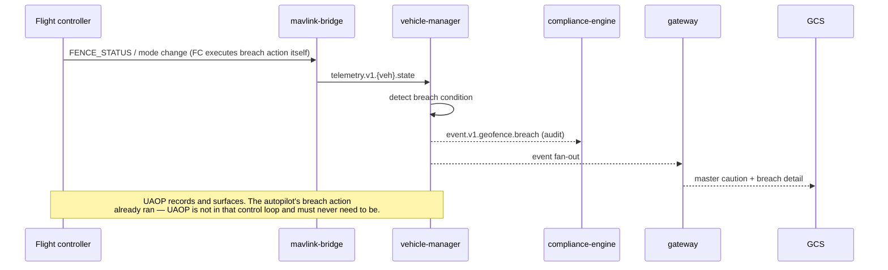

# EVENT_FLOW

**Version 0.1.0 · 2026-07-03 · NATS JetStream subject taxonomy, delivery semantics, and the event catalog.**

## 1. Subject taxonomy (versioned in-subject)

```
uaop.telemetry.v1.<vehicle_id>.<category>   category ∈ {position, attitude, velocity, imu,
                                            ekf, battery, esc, rc, link, rf, health, state, remoteid}
uaop.event.v1.<domain>.<event>              domain ∈ {vehicle, mission, param, geofence, failsafe,
                                            remoteid, log, ai, node, sim, compliance}
uaop.cmd.v1.<vehicle_id>.<command>          arm, disarm, mode, rtl, takeoff, land, mission_start ...
uaop.ai.v1.<vehicle_id>.<artifact>          flight_report, tuning_recommendation, anomaly, health
uaop.audit.v1                               single persistent audit intake stream
```

Rules: subjects are **data contracts** — additions need a contract PR; wildcard consumption (`uaop.event.v1.>`) is reserved for compliance-engine and observability; `v2` subjects may coexist with `v1` during deprecation windows.

## 2. Stream configuration

| JetStream stream | Subjects | Storage | Limits / policy |
|---|---|---|---|
| TELEMETRY | `uaop.telemetry.v1.>` | File, interest-based | 24 h / size-capped; consumers: telemetry-engine (durable), gateway (ephemeral), ai-engine (durable, Ph2) |
| EVENTS | `uaop.event.v1.>` | File | 30 d; all domain consumers durable |
| COMMANDS | `uaop.cmd.v1.>` | File | Permanent until audit-confirmed; work-queue to vehicle-manager |
| AI | `uaop.ai.v1.>` | File | 30 d |
| AUDIT | `uaop.audit.v1` | File, fsync-on-write; single-node R1 on edge (durability = fsync + backup + chain verification — R1/F4), R3 in cloud tier | Never truncated before compliance-engine ack + chain append; command admission gates on persistence here (ADR-0015) |

## 3. Delivery semantics

- **At-least-once everywhere.** Every event carries a UUIDv7 `event_id`; consumers dedup on it (Postgres unique constraint or Redis TTL set). Idempotency is a review checklist item, not an aspiration.
- **Ordering:** guaranteed per subject only. Consumers needing cross-category order (vehicle-manager's state machine) order by the envelope's `sequence` (per-vehicle monotonic, assigned by the originating bridge).
- **Commands are not fire-and-forget:** `uaop.cmd.v1.>` is a work queue consumed solely by vehicle-manager; result comes back as a correlated event (`correlation_id`), and the gateway holds the client request open against it (with timeout → explicit UNKNOWN status, never fake success).

## 4. Event envelope (canonical)

```protobuf
message EventEnvelope {
  string event_id = 1;        // UUIDv7
  string schema = 2;          // e.g. "uaop.event.vehicle.state_changed/1"
  uint64 sequence = 3;        // per-source monotonic
  google.protobuf.Timestamp occurred_at = 4;
  string source_service = 5;
  string vehicle_id = 6;      // empty for platform events
  string correlation_id = 7;  // command/request causality
  string actor = 8;           // operator identity for human-initiated events
  bool sim = 9;               // simulation provenance — never dropped in transit
  bytes payload = 10;         // schema-versioned message
}
```

## 5. Event catalog (Phase 1 core — additions via contract PR)

| Event | Emitted by | Notes |
|---|---|---|
| `vehicle.connected / disconnected / state_changed` | vehicle-manager | state_changed carries from/to + cause |
| `vehicle.command_result` | vehicle-manager | correlated; ACCEPTED / REJECTED(reason) / TIMEOUT |
| `failsafe.triggered` | vehicle-manager | audit-critical; reason from FC failsafe bits |
| `mission.uploaded / verified / diverged / progress` | mission-engine | uploaded carries plan hash |
| `geofence.uploaded / breach` | mission-engine / vehicle-manager | breach is audit-critical |
| `param.written / write_failed` | parameter-engine | old/new/operator/risk class |
| `remoteid.broadcast_ok / broadcast_lost` | remote-id | lost = master caution |
| `log.captured / analysis_complete` | flight-log-engine / ai-engine | |
| `ai.recommendation_{shown,applied,dismissed}` | gateway/UI relay | closes the advisory audit loop (ADR-0012) |
| `node.degradation / restored` | node supervisor | ladder position (EDGE_ARCHITECTURE.md §4) |
| `telemetry.gap` | telemetry-engine | explicit loss accounting |
| `compliance.checklist_signed / authorise_flight` | compliance-engine | operator identity bound |

## 6. Choreography example — geofence breach



## 7. Failure semantics of the bus itself

| Failure | Behavior |
|---|---|
| NATS restart | Durable consumers resume by ack floor; publishers ride bounded buffers (bridge rings); gap accounting covers any overflow |
| Consumer poison message | Max-deliver with dead-letter subject `uaop.dlq.<consumer>` + alarm; DLQ is monitored, never a black hole |
| Slow consumer (ephemeral/UI) | Gateway sheds per-client oldest-first with staleness flag; durable consumers instead grow lag metrics and alarm |
| Stream storage full | Publishes fail loudly (metrics + node.degradation); precedence: AUDIT > COMMANDS > EVENTS > TELEMETRY when trimming |
