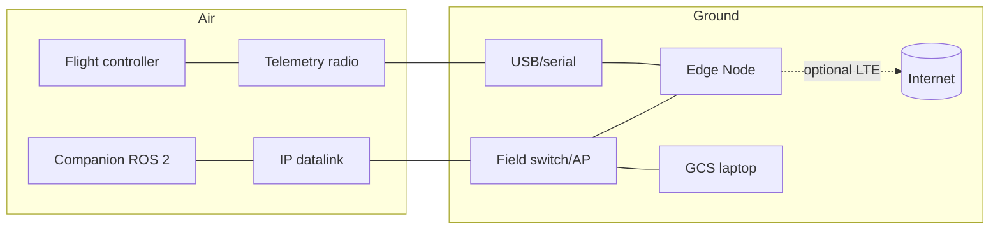

# HARDWARE_ARCHITECTURE

**Version 0.1.0 · 2026-07-03 · UAOP ships software; this document defines the hardware envelopes that software must honor and the reference configurations we test against.**

## 1. Position

UAOP does not manufacture hardware. We define **reference configurations** (tested, supported) and **minimum envelopes** (UAOP-NFR-003/006 are verified against these). Anything meeting the envelope should work; only reference configs are certified-by-test.

## 2. Reference configurations

### RC-1 — Developer workstation (Phase 1)
| Item | Spec |
|---|---|
| CPU / RAM | 8-core x86_64 / 32 GB (16 GB minimum) |
| GPU | Optional; required only for Gazebo GUI + AirSim-class sim |
| OS | Ubuntu 22.04 LTS (primary), Windows 11 + WSL2 (supported for services; GCS native) |
| Role | Full stack via Docker Compose + SITL + Qt GCS on one machine |

### RC-2 — Edge Node, rugged x86 (Phase 2+, field ops)
| Item | Spec |
|---|---|
| Platform | Fanless rugged mini-PC (e.g., 8-core x86_64, 32 GB RAM, 1 TB NVMe) |
| I/O | 2× Ethernet (telemetry radio LAN / operator LAN separation), 4× USB (serial radios), optional LTE module |
| Power | 12–24 V DC vehicle/battery supply, graceful shutdown on brownout (see §5) |
| Environment | Field-tolerant: -20…+60 °C, dust/moisture per enclosure rating |

### RC-3 — Edge Node, ARM64 (Phase 3+, SWaP-constrained)
| Item | Spec |
|---|---|
| Platform | NVIDIA Jetson Orin NX 16 GB (Orin AGX for multi-vehicle + heavy ONNX inference) |
| Storage | 512 GB NVMe minimum — TimescaleDB at 1000 Hz is storage-hungry (DATABASE.md retention math) |
| Budget | Full stack ≤ 50% CPU steady-state, 1 vehicle (UAOP-NFR-003), leaving headroom for inference bursts |
| Note | All C++ services build ARM64 from Phase 1 CI — cross-arch is never a retrofit |

### RC-4 — Cloud (Phase 4)
Managed Kubernetes, x86_64 nodes; sizing in CLOUD_ARCHITECTURE.md. No UAOP-specific hardware demands.

## 3. Vehicle-side interfaces (what UAOP connects to, not what it ships)

| Interface | Transport | UAOP endpoint |
|---|---|---|
| Telemetry radio (SiK 915/433, RFD900) | Serial/USB → MAVLink | mavlink-bridge serial link |
| WiFi/Ethernet datalink | UDP/TCP MAVLink | mavlink-bridge network link |
| LTE C2 (BVLOS) | UDP MAVLink over VPN | mavlink-bridge network link + link-quality monitor |
| Companion computer | Ethernet/WiFi DDS | ros2-bridge (same L2 or routed multicast — see ROS2_INTEGRATION.md discovery notes) |
| Video | RTSP/WebRTC | video ingestion (GCS display path) |
| HIL bench | USB/serial to real FC | simulation-engine HIL harness (Phase 3) |

## 4. Network topology (edge deployment)

Two physical segments on the Edge Node where possible: **vehicle-facing** (radios, datalink — Zone 0) and **operator-facing** (GCS laptops — Zone 2). A single-NIC deployment is permitted for Phase 1 development only.

## 5. Failure modes and hardware-level mitigations

| Failure | Effect | Mitigation (software honors this) |
|---|---|---|
| Edge power loss | Platform down; **flight unaffected** — autopilot failsafes (RC/RTL) are independent by design | Supervised UPS/DC buffer triggers clean shutdown; on reboot, services recover from JetStream/DB (cold start ≤ 120 s, UAOP-NFR-006); operator briefed that autopilot link-loss failsafe governs |
| Serial radio unplugged | Link loss on that vehicle | Heartbeat timeout ≤ 3 s (UAOP-HLR-004); auto-reconnect with device re-enumeration; UI staleness state |
| NVMe exhaustion | Telemetry history writes fail | Disk watermarks alarm at 80/90%; retention job downsamples/evicts oldest history; live streaming and audit chain are prioritised writes — audit full = master caution |
| Thermal throttling (Jetson) | Latency degradation | Prometheus thermal alerts; ONNX inference sheds first (advisory tier), core pipeline last |
| Clock loss (no NTP in air-gap) | Audit timestamps drift | GPS-disciplined time from vehicle stream as fallback source; monotonic sequence numbers make the hash chain order-proof regardless of wall clock |

## 6. Procurement guidance (Phase 1 spend ≈ zero)

Phase 1 needs only RC-1 (existing developer machine). First hardware purchases (Phase 2): one RFD900-class radio pair + one Pixhawk-class FC for HIL/bench (~modest cost), one used rugged mini-PC as RC-2 prototype. Jetson deferred until Phase 3 unless an early defense conversation requires the demo.
