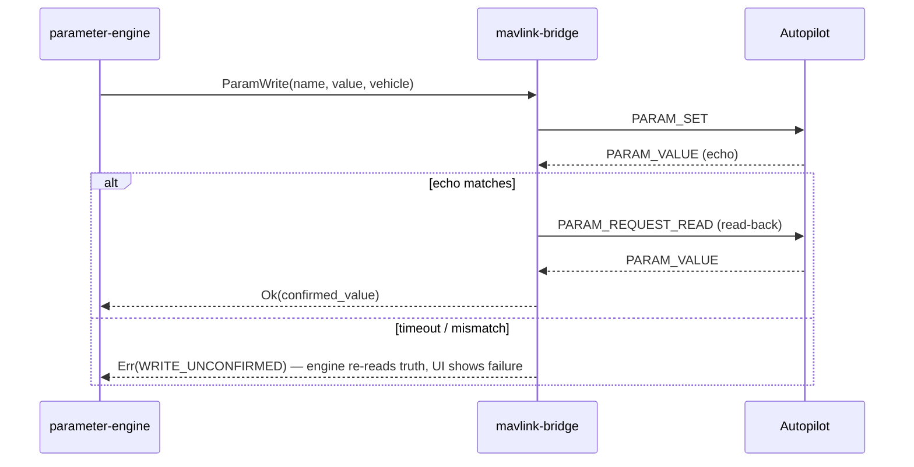

# MAVLINK_INTEGRATION

**Version 0.1.0 · 2026-07-03 · How UAOP speaks to PX4 and ArduPilot. Owner service: mavlink-bridge (MICROSERVICES.md).**

## 1. Scope and stance

MAVLink v2 is the only vehicle control/telemetry protocol in Phases 1–3. UAOP is a **GCS-class MAVLink peer** (its own system ID, component `MAV_COMP_ID_MISSIONPLANNER-`class): it commands and observes; it never emulates an autopilot component. Library: upstream `pymavlink`-generated C headers / `MAVSDK` evaluation rejected — we need message-level control for the bridge's zero-copy path and dialect handling; we consume upstream **message definitions (XML)** and generate our parser tables at build time, pinning the definitions per release.

## 2. Dialects and the two-autopilot problem

PX4 and ArduPilot share common.xml but diverge meaningfully (modes, mission item semantics, parameter conventions). The bridge normalizes this behind one canonical model:

| Concern | PX4 | ArduPilot | Canonical handling |
|---|---|---|---|
| Flight modes | `custom_mode` PX4 scheme | per-vehicle-type mode numbers | `FlightMode` enum + per-stack mapping tables, versioned per firmware release |
| Missions | MISSION_ITEM_INT, mission microservice | same protocol, different accepted commands | capability probe at connect (AUTOPILOT_VERSION + probe transfers); unsupported items refused at validation, not at upload |
| Parameters | float-typed + metadata from firmware repo | mixed types, apm.pdef metadata | parameter-engine metadata packs per firmware family/version |
| Commands | COMMAND_LONG/INT with PX4 semantics | ArduPilot semantics (e.g., arming checks) | command adapter with per-stack quirk table, unit-tested per firmware release we claim support for |
| Telemetry extras | ESC_TELEMETRY, jamming/spoofing in GPS_RAW_INT | ESC via ESC_TELEMETRY_1_TO_4 etc. | mapped into one `VehicleTelemetry` contract |

**Supported-firmware policy:** we claim support only for firmware versions in our CI SITL matrix (PX4 v1.14+, ArduCopter/ArduPlane 4.5+ initially). Everything else is "best effort, flagged UNVERIFIED in UI".

## 3. Message handling (Phase 1 census)

Ingested and mapped to `VehicleTelemetry` (full field census in TELEMETRY_ENGINE.md): HEARTBEAT, SYS_STATUS, SYSTEM_TIME, GPS_RAW_INT (incl. `jamming_indicator`, `spoofing_state`, DOP), GLOBAL_POSITION_INT, ATTITUDE(+QUATERNION), VFR_HUD, LOCAL_POSITION_NED, HIGHRES_IMU/RAW_IMU, SCALED_PRESSURE, BATTERY_STATUS (per-cell), ESC_TELEMETRY_*, RC_CHANNELS, RADIO_STATUS, ESTIMATOR_STATUS, VIBRATION, WIND_COV, EXTENDED_SYS_STATE, HOME_POSITION, MISSION_CURRENT, STATUSTEXT (severity-mapped to UI notices), FENCE_STATUS, OPEN_DRONE_ID_* (Remote ID observation).

Transactional protocols implemented in full, per spec, with state machines and retry: **mission microservice** (upload/download/clear, INT variants only), **parameter protocol** (with PARAM_EXT awareness), **command protocol** (COMMAND_ACK tracking incl. IN_PROGRESS), **ftp** (log download where supported, else LOG_REQUEST_*).

## 4. Stream rate management

At connect, the bridge requests rates via SET_MESSAGE_INTERVAL (PX4) / REQUEST_DATA_STREAM fallback (older ArduPilot): attitude/IMU ≥ 50 Hz where link budget allows, position 10 Hz, status 2 Hz, adaptive downgrade on link-quality decay (RADIO_STATUS txbuf/rssi) with an explicit `link.degraded` event — bandwidth adaptation is visible, never silent.

## 5. Link layer

- **Serial** (SiK/RFD900): auto-baud, device re-enumeration on USB path changes, exclusive open by the bridge only.
- **UDP** client & server modes (SITL uses server); **TCP** client.
- Multi-vehicle on one link (radio mesh) routed by (sysid, compid); **sysid collision** quarantines both claimants (MICROSERVICES.md).
- **MAVLink 2 signing:** supported per-link (key provisioning via SECURITY.md secrets flow). Policy: required on WAN/LTE C2 links, recommended on RF, optional on bench. Unsigned frames on a signing-required link are counted and dropped.

## 6. Robustness requirements (this is Zone 0)

- Parser is fuzzed in CI (structure-aware, seeded with valid frames) — `@req: UAOP-LLR-001-xx` family.
- All lengths/enums bounds-checked; unknown message IDs ignored-and-counted (forward compat); malformed frames can never allocate, throw, or crash (ADR-0013).
- Timing: per-message-type staleness tracked; HEARTBEAT loss ≥ 3 s → link-loss state (UAOP-HLR-004) with LED-clear UI state (UX_GUIDELINES.md).
- The bridge never invents data: absent optional fields propagate as absent (proto3 optionality), and the UI renders "—", never zero.

## 7. Sequence — parameter write with verification (UAOP-HLR-021)

## 8. Testing strategy binding

Every claim in this document maps to the SITL matrix in TESTING.md: connect/reconnect storms, mission round-trips (100-item plans), parameter full-table churn, link-loss/recovery during transfers, malformed-frame fuzz corpus, dual-stack (PX4+ArduPilot simultaneously) routing. The Phase 1 exit gate runs this matrix green.
