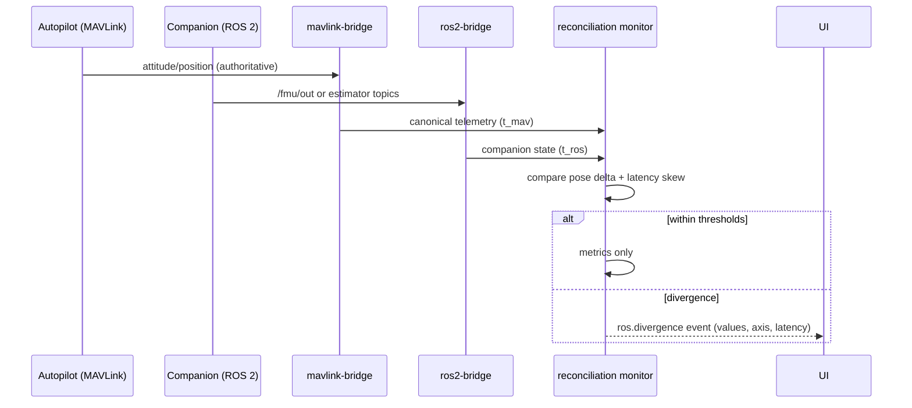

# ROS2_INTEGRATION

**Version 0.1.0 · 2026-07-03 · Phase 2. Owner service: ros2-bridge (`middleware/ros2-bridge/`). Replaces RViz/rqt for operational introspection (UAOP-HLR-060/061).**

## 1. Stance

ROS 2 is the companion-computer ecosystem: perception, offboard behaviors, payload autonomy. UAOP's job is **visibility and disciplined interchange**, not becoming a ROS application. The ros2-bridge is the only DDS-speaking process (SYSTEM_ARCHITECTURE.md invariant 1); everything ROS-shaped is translated to canonical contracts at this boundary, keeping DDS discovery storms, QoS complexity, and rmw quirks out of the core.

Distro: **Humble** (constitution). Humble EOL (May 2027) tracked as R-9; the bridge isolates the platform from the Jazzy migration by design.

## 2. Capabilities

| Capability | Mechanism |
|---|---|
| Node list + lifecycle states | graph events + `lifecycle_msgs` services; lifecycle transitions executable from UI (audit-logged) |
| Topic browser, live inspector | dynamic subscription via type introspection (no compiled-in message set); rate/bandwidth per topic |
| Node graph rendering | graph API → gRPC → GCS canvas panel |
| Topic → NATS bridging | allowlisted topics mapped to `uaop.telemetry.v1.*`/`uaop.event.v1.ros.*` with declared conversions |
| MAVLink↔ROS state reconciliation | see §4 — the hard requirement |
| Parameter view of ROS nodes | `rcl` parameter services surfaced read-only Phase 2 |

Deliberately excluded: arbitrary ROS *publishing* from UI (Phase 2 read-first posture; controlled publish arrives with the plugin capability model), and bridging unbounded topics (images/pointclouds go via the video path or stay in ROS — the NATS bus is not a DDS mirror).

## 3. QoS and discovery engineering notes

- Bridge subscribes with **compatible-lax QoS** (best-effort sensor data, reliable for state topics) and reports QoS mismatches as diagnostics instead of silently not receiving — the #1 field complaint in ROS integrations.
- Discovery: same-L2 multicast default; routed networks use discovery server config in the deployment profile. The bridge runs host-network in k3s for DDS (EDGE_ARCHITECTURE.md).
- Type support: runtime introspection (`rosidl_typesupport_introspection_cpp`) so unknown/custom message types still get field-level display; allowlisted bridged topics require registered conversions (contract PR) — introspection for looking, contracts for flowing.

## 4. MAVLink↔ROS 2 reconciliation (UAOP-HLR-061)

When a companion runs offboard control (e.g., PX4 + XRCE-DDS or MAVROS), UAOP sees vehicle state twice. Rules:

1. **MAVLink is authoritative** for flight state, mode, and failsafe (it is the FC's own voice).
2. ROS-side estimates are rendered as companion-frame data, clearly labeled — never merged into `VehicleTelemetry` FC fields.
3. A reconciliation monitor compares position/attitude across both paths; divergence beyond thresholds or cross-path latency > 50 ms (P95) raises `uaop.event.v1.ros.divergence` — this is a diagnostic gift (EKF vs perception disagreement), surfaced, not averaged away.

## 5. Failure modes & recovery

| Failure | Behavior |
|---|---|
| DDS discovery storm / graph flapping | debounced graph model; UI shows CHURNING state instead of repainting chaos |
| Companion reboot | bridge re-discovers; bridged-topic gaps produce explicit gap events |
| QoS mismatch | surfaced as per-topic diagnostic with both profiles printed |
| rmw memory growth (known DDS pain) | bridge runs with memory limits + restart tolerance; restart loses no platform state (projections rebuild) |
| Type introspection failure on custom msg | field-level view degrades to raw; bridging of that topic refused with reason |

## 6. Security

DDS security (SROS2) is **off by default in Phase 2** (matches ecosystem reality on companions) and the bridge treats DDS as Zone 0 input: bounds-checking on introspected data, allowlist-only bridging, no DDS-originated commands, period. SROS2 enablement is a Phase 4 hardening option where customer companions support it. This honest posture — "we contain ROS, we don't pretend to secure it" — is defensible in a security review; pretending otherwise is not.

## 7. Scalability & future

One companion per vehicle assumed initially; bridge instances scale per-vehicle if needed (subject-partitioned like everything else). Jazzy support = new bridge build profile, core untouched. Nav2/behavior-tree state visualization is a natural Phase 3+ panel built on the same introspection substrate; MAVROS-based fleets work today since we sit at MAVLink regardless.
