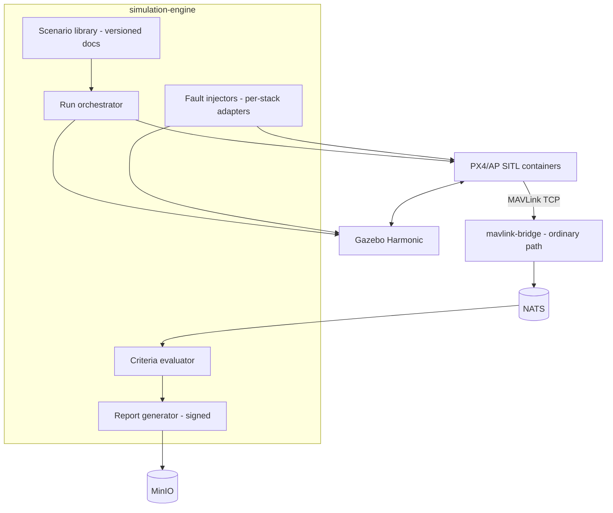

# SIMULATION_ARCHITECTURE

**Version 0.1.0 · 2026-07-03 · Phase 3 (SITL basics from Phase 1 CI). Owner: simulation-engine. Requirements: UAOP-HLR-050/052.**

## 1. Purpose

Simulation serves four masters with one substrate: **development** (SITL in every engineer's loop), **validation** (the CI/certification test runner), **training** (Phase 3 scenarios + scoring), and the **digital twin** (DIGITAL_TWIN.md). Design axiom from DATA_FLOW.md §7: simulated vehicles traverse the *identical* pipeline as real ones, tagged `sim=true` end-to-end — the platform cannot behave differently in sim, which is precisely what makes sim results meaningful.

## 2. Stack

| Component | Choice | Note |
|---|---|---|
| Autopilot-in-loop | PX4 SITL, ArduPilot SITL | pinned to the supported-firmware matrix (MAVLINK_INTEGRATION.md §2) |
| Physics/world | Gazebo **Harmonic** | ADR-0003 (Garden EOL'd) |
| Photorealistic / camera-heavy | AirSim successor (Colosseum / Project AirSim) | **risk-flagged R-8**: upstream archived; treat as optional adapter, never a dependency of the validation runner |
| HIL | real FC on USB bench + Gazebo | Phase 3; the certification runner's highest-fidelity tier |

Adapters follow the ecosystem rule: simulation-engine drives simulators through their own interfaces (gz-transport, SITL TCP, lockstep), never forks.

## 3. Orchestration model

simulation-engine composes **SimRuns** from declarative **Scenario** documents:

```yaml
scenario: gps_loss_rtl_urban
autopilot: { stack: px4, version: v1.14.2, airframe: quad_x }
world: new_delhi_urban            # from environment library
wind: { base_mps: 6, gust_mps: 15, gust_period_s: 40 }
mission: missions/survey_12wp.plan
injections:
  - { at: wp:6, fault: gps_loss, duration_s: 25 }
  - { at: t+300, fault: battery_sag, cell_drop_v: 0.35 }
pass_criteria:
  - ekf_fallback_engaged_within_s: 5
  - rtl_triggered: true
  - max_position_error_m: 15
  - no_geofence_breach: true
```

The engine launches SITL+Gazebo (containers), wires MAVLink into the ordinary mavlink-bridge, executes injections at trigger points, evaluates criteria against the recorded (ordinary) telemetry stream, and emits a **SimReport** (JSON + signed PDF for the certification runner — UAOP-HLR-052).

Failure injection library (Phase 3 initial): GPS loss/degradation, GPS jamming/spoofing indicator simulation, motor-out, compass jam, comms loss (link kill at the bridge — testing *our* link-loss handling too), battery sag, wind gusts, baro fault. Injection mechanisms use each stack's native failure APIs (PX4 `failure inject`, ArduPilot SIM_ parameters) — again, no forks.

## 4. Component view



## 5. Subsystem template

- **Purpose/Responsibilities:** above.
- **Interfaces:** gRPC (launch/stop/status/library CRUD); events `uaop.event.v1.sim.*`; consumes ordinary telemetry for evaluation.
- **Dependencies:** container runtime (talks to k3s API to spawn run pods), mavlink-bridge, NATS, MinIO, Postgres (run metadata).
- **Failure modes:** SITL lockstep stall (watchdog kills run, marked INCONCLUSIVE — never PASS by timeout); Gazebo crash (run aborts, artifacts preserved for debugging); resource contention with live ops (**sim workloads are tier-3 in the degradation ladder — a live vehicle always evicts sim**); nondeterminism (seeded runs; criteria evaluated statistically over N runs where physics noise matters, with N recorded in the report).
- **Recovery:** runs are disposable and idempotent; the library and reports are the durable assets.
- **Security:** scenario docs are code-adjacent (injection triggers) — signed like plugins when imported; sim vehicles are unmistakably marked in every UI surface (watermark per UX_GUIDELINES.md) so a sim can never be mistaken for a live aircraft. `sim=true` provenance is enforced by compliance-engine (sim events excluded from operational audit exports by default, retained separately for training records).
- **Scalability:** headless runs parallelize (CI farm: N SITL instances per node, no Gazebo GUI); multi-vehicle scenarios (Phase 3 target: 5+ vehicles in one world) bound by physics rate — evaluator supports faster-than-realtime where lockstep allows.

## 6. SITL in CI (from Phase 1, before this engine exists)

Phase 1 CI runs bare PX4/ArduPilot SITL in Docker against the platform for the validation gate (connect, telemetry rates, mission round-trip, param write, failsafe surfacing). The Phase 3 engine *productizes* what CI already does — deliberate sequencing so the certification runner is hardened by two phases of CI service before customers see it.

## 7. Certification test runner (UAOP-HLR-052)

A named suite (versioned set of scenarios + criteria) → N seeded runs → signed PDF/JSON with: platform versions, firmware versions, scenario hashes, per-criterion evidence links into stored telemetry. This artifact is designed to slot into a SORA/type-cert evidence package — which is why signatures, hashes, and version pinning are in the data model from the start, not decoration.
