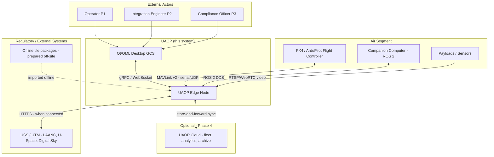
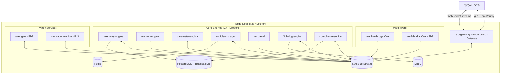
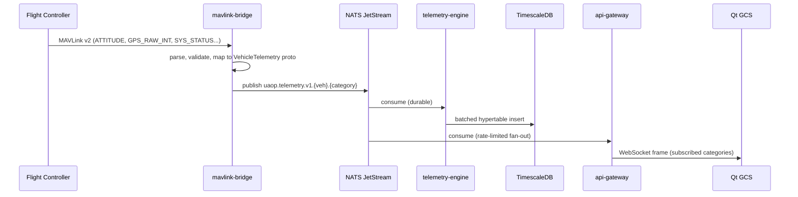
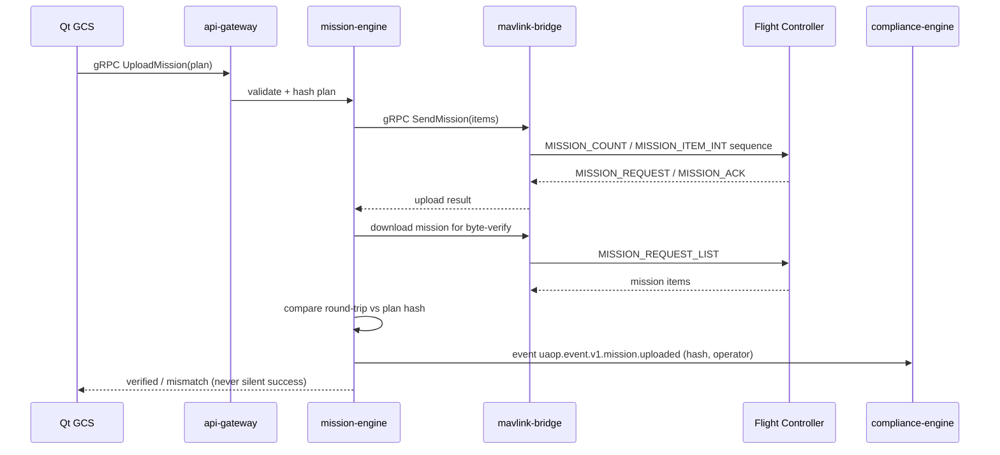
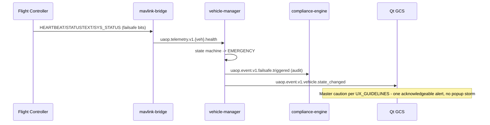
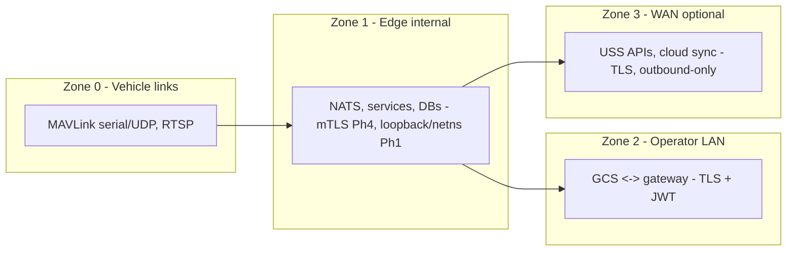

# SYSTEM_ARCHITECTURE

**Version 0.1.0 · 2026-07-03 · C4 level 1–2 (context + containers). Component detail: SOFTWARE_ARCHITECTURE.md, MICROSERVICES.md.**

## 1. System context (C4-1)

UAOP is a ground-segment platform. Everything airborne stays in the flight stack's assurance boundary; UAOP observes, plans, configures, and records.

**Boundary rules:**
- The **flight controller is authoritative** for all control. UAOP issues MAVLink commands (arm, mode, mission) that the autopilot may refuse; UAOP never bypasses autopilot safety logic.
- The **USS link is optional at runtime**. Air-gap deployments run with regulatory functions in record-and-defer mode.
- The **cloud link is optional always** (UAOP-NFR-001, UAOP-HLR-072).

## 2. Container view (C4-2) — one Edge Node

**Reading the diagram:** the bus is the only many-to-many surface. Databases are service-private (telemetry-engine owns TimescaleDB hypertables; compliance-engine owns audit tables; no cross-service SQL — MICROSERVICES.md enforces ownership).

## 3. Segment responsibilities

| Segment | Owns | Explicitly does not own |
|---|---|---|
| Flight stack (PX4/ArduPilot) | Control loops, EKF, failsafe execution, mode logic | — |
| Companion (ROS 2) | Perception, offboard autonomy behaviors | Flight-critical failsafe |
| **UAOP Edge Node** | Ingest, supervision, mission/parameter management, recording, compliance, AI advisories, simulation | Control loops; autonomous command origination |
| **UAOP GCS** | Presentation, operator intent capture, local interaction state | Business logic (thin client over gateway APIs) |
| UAOP Cloud (Ph4) | Fleet aggregate views, long-term archive, org administration | Anything a flight depends on |

## 4. Key end-to-end sequences

### 4.1 Telemetry (steady state)

### 4.2 Mission upload (command path with verification — UAOP-HLR-010/012)

### 4.3 Failsafe surfacing (vehicle-originated)

## 5. Trust zones

Zone 0 is the least trustworthy despite being "our" vehicle: MAVLink is unauthenticated by default (signing optional), so the bridge treats every frame as untrusted input (bounds-check, rate-limit, never crash on malformed frames). Details: SECURITY.md.

## 6. Architecture invariants (violations are defects)

1. No service other than mavlink-bridge speaks MAVLink; no service other than ros2-bridge speaks DDS.
2. No service reads another service's database.
3. ai-engine cannot publish on `uaop.cmd.>` (ADR-0012, enforced by NATS permissions).
4. Every vehicle-bound command traverses vehicle-manager's authority check and is audit-logged before transmission.
5. The GCS contains no business logic that would make two GCS instances disagree given the same edge state.
6. Loss of any Zone 3 connection changes **nothing** about Zones 0–2 behavior except sync/USS status indicators.
