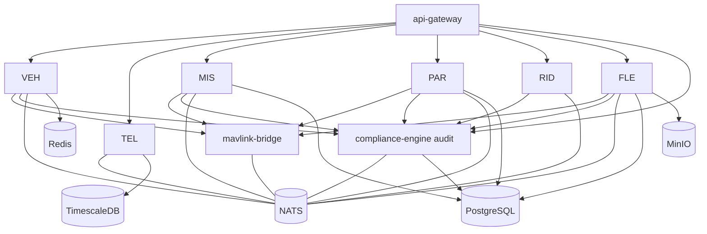

# MICROSERVICES — Service Catalog

**Version 0.1.0 · 2026-07-03 · One entry per service, uniform template. Deep design for the five engines lives in their own documents.**

Global rules (apply to every service; not repeated below):
- Communicates only via NATS subjects and declared gRPC contracts; owns its database objects exclusively.
- Exposes `/healthz` (liveness), `/readyz` (readiness), Prometheus `/metrics`, and structured JSON logs (LOGGING.md).
- Idempotent NATS consumption (at-least-once delivery, dedup by event ID).
- Fails fast on invalid config; supervised restart by k3s (recovery baseline UAOP-NFR-004).
- Error taxonomy: TRANSIENT (retry/backoff) · INVALID (reject) · FATAL (restart).

---

## mavlink-bridge (C++ · Phase 1 · `middleware/mavlink-bridge/`)

- **Purpose:** Sole MAVLink v2 boundary. Terminates vehicle links; translates frames ↔ canonical protobuf/NATS.
- **Responsibilities:** Link lifecycle (serial/UDP/TCP, reconnect, multi-vehicle routing by sysid); frame validation (CRC, bounds, rate limits); publish `uaop.telemetry.v1.*`; execute command/mission/parameter transactions against the FC on behalf of engines (gRPC server); MAVLink signing when enabled; per-link quality metrics.
- **Interfaces:** In — serial/UDP/TCP MAVLink; gRPC `VehicleLink` (SendCommand, MissionTransfer, ParamIO). Out — NATS telemetry/events; link-quality metrics.
- **Dependencies:** NATS. **No database** (stateless except link registry in Redis).
- **Failure modes:** malformed/hostile frames (Zone 0 untrusted — drop + count, never crash); serial device disappearance; NATS unavailability (bounded ring buffer, then counted loss + gap event); sysid collision between vehicles (quarantine + alarm, refuse ambiguous routing).
- **Recovery:** restart is cheap (stateless); links re-enumerate and reconnect automatically; in-flight transactions (mission upload) are reported failed to callers, never assumed.
- **Security:** input hardening is the primary duty (fuzzed in CI); optional MAVLink 2 signing; the only process with serial device access.
- **Scalability:** thread-per-link with lock-free rings; 255-vehicle ceiling is MAVLink's sysid space; horizontal split by link group if a node ever needs it.

## vehicle-manager (C++ · Phase 1 · directory to be created)

- **Purpose:** Authoritative registry and supervisor of vehicle state; the command-authority gate.
- **Responsibilities:** Per-vehicle state machine (UAOP-HLR-002); heartbeat/link-loss detection (≤3 s, UAOP-HLR-004); command authorisation (who may arm/mode-switch what) + audit emission before transmission; failsafe event surfacing; home-position and flight-time tracking; veto authority over node updates while ARMED/IN_FLIGHT.
- **Interfaces:** In — telemetry/health subjects; gRPC command API (from gateway). Out — `uaop.event.v1.vehicle.*`; authorised commands to mavlink-bridge; last-known state to Redis.
- **Dependencies:** NATS, Redis, mavlink-bridge (gRPC), compliance-engine (audit events).
- **Failure modes:** stale state after own restart (rebuild from Redis + live stream within 2 s, marked PROVISIONAL until first heartbeat); conflicting commands from two GCS sessions (serialised, both audit-logged, second gets explicit CONFLICT); state-machine deadlock (watchdog transition to UNKNOWN + alarm, never a silently wrong state).
- **Recovery:** Redis snapshot + stream replay; PROVISIONAL marking prevents acting on stale authority.
- **Security:** the RBAC enforcement point for every vehicle-bound command; owns the per-vehicle ControlSession authority model (ADR-0017); refuses commands whose audit event cannot be durably persisted (fail-closed at JetStream per ADR-0015; EMERGENCY class has a local WAL fallback).
- **Scalability:** state machines are tiny; scales to 255 vehicles trivially; partition by vehicle-id if federated later.

## telemetry-engine (C++ · Phase 1) — deep design in TELEMETRY_ENGINE.md

- **Purpose:** Persistence and query of all telemetry; the platform's memory.
- **Responsibilities:** Durable consumption of all telemetry subjects; batched TimescaleDB writes (to 1000 Hz); retention/downsampling policy; historical query gRPC; snapshot/delta generation for constrained consumers.
- **Interfaces:** In — NATS telemetry; gRPC query API. Out — TimescaleDB; `uaop.event.v1.telemetry.gap` on detected loss.
- **Dependencies:** NATS, TimescaleDB.
- **Failure modes:** DB write stall (JetStream buffers; shed history per degradation ladder, live stream unaffected because fan-out is gateway-side); hypertable bloat (watermark alarms + retention jobs); consumer lag (metrics + alarm).
- **Recovery:** durable consumer resumes from last ack; gap events make any loss explicit and queryable.
- **Security:** read API is RBAC-scoped (an OBSERVER sees streams, not exports).
- **Scalability:** partition hypertables by vehicle+time; batch size adapts to load; cloud tier gets downsampled continuous aggregates.

## mission-engine (C++ · Phase 1) — deep design in MISSION_ENGINE.md

- **Purpose:** Mission and geofence lifecycle with verified transfer (UAOP-HLR-010/011/012).
- **Responsibilities:** Plan CRUD + validation (terrain/battery/geofence feasibility checks); PX4/ArduPilot dialect handling via bridge; upload + round-trip byte verification; mission hash identity; geofence upload and breach-action config; mission progress projection from telemetry.
- **Interfaces:** In — gRPC plan API; vehicle state events. Out — bridge MissionTransfer; `uaop.event.v1.mission.*`; Postgres (plans, versions).
- **Dependencies:** NATS, PostgreSQL, mavlink-bridge, vehicle-manager (authority), compliance-engine (audit).
- **Failure modes:** partial upload (protocol timeout → verified re-transfer or explicit failure; never "probably uploaded"); dialect mismatch (capability probe before transfer, refuse unsupported items with reasons); plan/vehicle divergence after FC-side edit (periodic verify against hash; divergence = alarm).
- **Recovery:** plans and versions in Postgres; any transfer is re-runnable idempotently.
- **Security:** upload requires authority check + audit; geofence changes are HIGH-risk writes (confirmation flow).
- **Scalability:** per-vehicle concurrency; plan library scales in Postgres.

## parameter-engine (C++ · Phase 1 · directory to be created)

- **Purpose:** Full-fidelity parameter management with versioned, validated, audited writes (UAOP-HLR-020/021).
- **Responsibilities:** Full param-set read/cache; metadata (type, range, group, docs) for PX4 and ArduPilot; write validation + ACK/read-back verification; per-session diffs and version history; file import/export; risk classification of writes (feeds tuning UI).
- **Interfaces:** In — gRPC param API. Out — bridge ParamIO; Postgres versions; `uaop.event.v1.param.written` (audit).
- **Dependencies:** NATS, PostgreSQL, mavlink-bridge, vehicle-manager, compliance-engine.
- **Failure modes:** unACKed write (report failure + re-read truth from FC — the FC is always the source of truth); metadata gaps for unknown firmware (degrade to type-only validation, flag UNVERIFIED range); mid-flight write attempts (policy: refuse HIGH-risk writes while IN_FLIGHT unless explicitly overridden + double-logged).
- **Recovery:** cache rebuilt by full param fetch; history immutable in Postgres.
- **Security:** every write audited with old/new/operator; range clamps are enforced server-side, not just in UI.
- **Scalability:** trivial (param sets are ~1–2k entries/vehicle).

## remote-id (C++ · Phase 1)

- **Purpose:** ASTM F3411-22a / Part 89 Remote ID monitoring, management, and evidence (UAOP-HLR-040).
- **Responsibilities:** Track broadcast state (WiFi NaN / BT5 / Network USS) from FC or broadcast module; verify ≥1 Hz cycles; display mandatory fields; USS network session status (F3548 stubs Phase 1, real Phase 4); audit-log broadcast cycles; emergency-status propagation.
- **Interfaces:** In — telemetry subjects (position, RID status); gRPC status API. Out — `uaop.event.v1.remoteid.*`; audit events; (Phase 4) USS HTTP client.
- **Dependencies:** NATS, compliance-engine; USS endpoints (optional, deferred gracefully when offline).
- **Failure modes:** broadcast stops mid-flight (detect within 3 s → master caution — this is a regulatory violation in progress, treated at failsafe severity); USS unreachable (record-and-defer, explicit NOT CONNECTED state).
- **Recovery:** stateless projection; rebuilds from stream.
- **Security:** RID data is public-by-design; integrity (proving *we broadcast*) is the asset — hence audit chain.
- **Scalability:** per-vehicle, trivial.

## flight-log-engine (C++ · Phase 1 · directory to be created)

- **Purpose:** Capture, store, and serve flight logs (ULog/DataFlash) with tamper evidence (UAOP-HLR-031/032).
- **Responsibilities:** Log download from FC / SITL capture; hash-at-capture chaining; MinIO storage (content-addressed); library metadata in Postgres; export (ULog/CSV/JSON); hand-off to ai-engine for analysis.
- **Interfaces:** In — gRPC library API; bridge log-transfer. Out — MinIO, Postgres, `uaop.event.v1.log.captured`.
- **Dependencies:** NATS, PostgreSQL, MinIO, mavlink-bridge.
- **Failure modes:** interrupted download (resumable chunked transfer, partials never enter the library); MinIO full (watermark alarms; log capture blocks with explicit error rather than silent drop — logs are compliance evidence).
- **Recovery:** content addressing makes every transfer idempotent.
- **Security:** logs are evidence — immutable objects, hash-verified on every read.
- **Scalability:** MinIO scales horizontally in cloud tier; edge retention by policy.

## compliance-engine (C++/Python · Phase 1)

- **Purpose:** The audit chain, checklists, and jurisdiction tooling (UAOP-HLR-041/042/043).
- **Responsibilities:** Append-only SHA-256 hash-chained audit log (single writer); chain verification + export; 30-item pre-flight checklist with gated AUTHORISE FLIGHT; SORA SAIL calculator + OSO checklist (Phase 2); jurisdiction adapters (LAANC/U-Space/Digital Sky — stubs Phase 1); RTM/compliance artifact export hooks.
- **Interfaces:** In — `uaop.event.v1.>` (durable, it consumes *everything* auditable) + `uaop.audit.v1`; gRPC audit/query/checklist API. Out — Postgres audit tables; PDF/JSON exports.
- **Dependencies:** NATS, PostgreSQL.
- **Failure modes:** Postgres chain-append failure (**per ADR-0015**: chain append is asynchronous — commands stay available as long as audit events persist durably in the JetStream AUDIT stream; append lag is a monitored golden signal, CAUTION at threshold); chain divergence on verify (quarantine + alarm; the verifier can prove where the break is); clock anomalies (monotonic sequence is ordering truth, wall clock is annotation).
- **Recovery:** chain resumes from last verified head; missed events replay from JetStream durable position.
- **Security:** the crown jewels; single-writer discipline, append-only grants (no UPDATE/DELETE at the DB role level).
- **Scalability:** audit volume is modest (events, not telemetry); partitioned by month.

## ai-engine (Python · Phase 2) — deep design in AI_ENGINE.md

- **Purpose:** Advisory analysis: log diagnostics (via `flightmd_core`, ADR-0014), live oscillation detection, anomaly scoring, PID recommendations, predictive maintenance.
- **Responsibilities/Interfaces/Failure modes:** see AI_ENGINE.md. Structural constraint repeated here: **no publish permission on `uaop.cmd.>`** (ADR-0012).

## ros2-bridge (C++ · Phase 2) — deep design in ROS2_INTEGRATION.md

- **Purpose:** Sole DDS boundary; ROS 2 graph introspection and topic bridging to NATS/gRPC.

## simulation-engine (Python/C++ · Phase 3) — deep design in SIMULATION_ARCHITECTURE.md

- **Purpose:** SITL/Gazebo orchestration, scenario + failure-injection library, certification test runner, digital-twin session management.

## fleet-management (C++ · Phase 4) — deep design in FLEET_MANAGEMENT.md

- **Purpose:** Multi-vehicle/multi-org operational aggregate; RBAC-scoped fleet actions.

## api-gateway (Node.js · Phase 1 · ADR-0004)

- **Purpose:** Single client-facing surface: REST/JSON queries, gRPC command forwarding, WebSocket stream fan-out, authn/z enforcement.
- **Responsibilities:** JWT validation + RBAC claim propagation; protocol translation; per-client stream subscription with rate shaping; API versioning; request logging (no bodies with secrets).
- **Interfaces:** In — HTTPS/WSS from GCS and (Ph4) web. Out — internal gRPC to services; NATS consume for streams.
- **Dependencies:** NATS, auth config; every engine's gRPC endpoint.
- **Failure modes:** slow client backpressure (per-connection queues with drop-oldest for telemetry frames + staleness flag — never let one slow client stall the fan-out); token expiry mid-session (clean re-auth flow, no silent stream death).
- **Recovery:** stateless; reconnecting clients resume by re-subscribing.
- **Security:** the enforcement perimeter — nothing internal is reachable except through it (plus NATS/DB ports firewalled to the node).
- **Scalability:** stateless replicas behind a local LB if a control-room deployment (many GCS seats) needs it.

## dji-service · fpv-service (**UNSCOPED — OQ-1**)

Directories exist in the repo; no planning document defines them. **Frozen**: no contracts, no dependencies may reference them until an ADR scopes them. If adopted, both are Zone 0 adapters peer to mavlink-bridge (same untrusted-input discipline), publishing into the same canonical telemetry contract — the architecture already has their seat waiting, which is the point of the adapter pattern.

---

## Dependency graph (Phase 1 services)

Longest command path: GCS → gateway → vehicle-manager (authority+audit) → mavlink-bridge → FC. Four hops, all on-node; latency budget 20 ms internal (leaves the rest of UAOP-NFR-002 for radio RTT).
