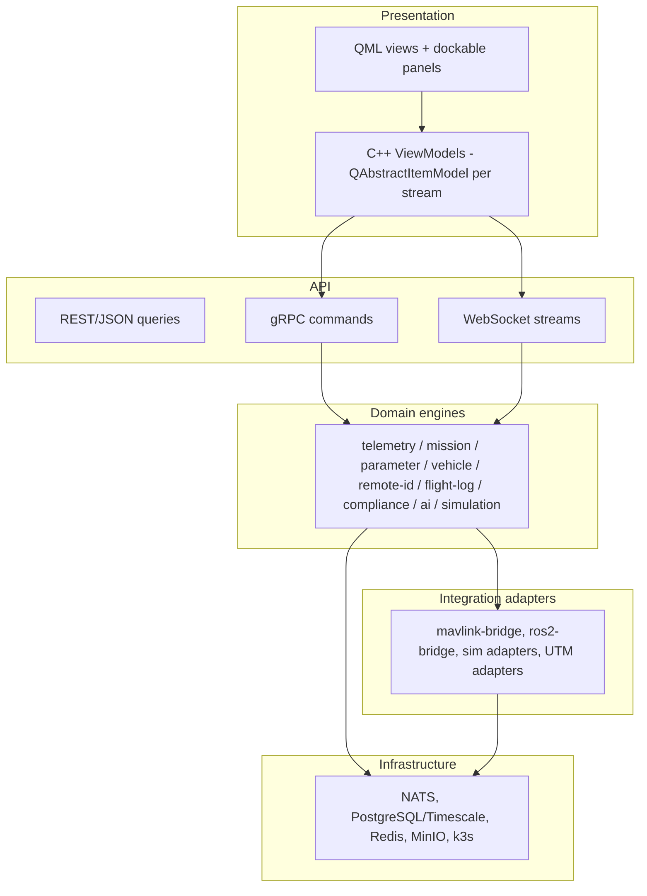
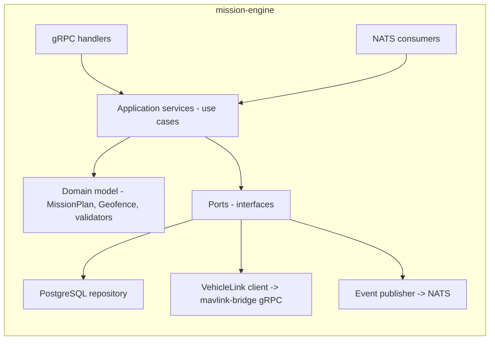

# SOFTWARE_ARCHITECTURE

**Version 0.1.0 · 2026-07-03 · C4 level 3 (components) + cross-cutting patterns. Per-service detail: MICROSERVICES.md and the engine documents.**

## 1. Layered model



**Dependency rule:** arrows point downward only. Domain engines know adapter *interfaces* (`VehicleLink`, `RosGraph`), never concrete protocols — dependency inversion at every ecosystem seam.

## 2. Domain-driven boundaries

Bounded contexts and their ubiquitous language (service ownership follows contexts, not technical layers):

| Context | Aggregate roots | Owned by |
|---|---|---|
| **Vehicle** | Vehicle (identity, link state, flight state machine, command authority) | vehicle-manager |
| **Telemetry** | TelemetryStream (per vehicle; snapshots, history) | telemetry-engine |
| **Mission** | MissionPlan (waypoints, geofences, hash identity, upload state) | mission-engine |
| **Configuration** | ParameterSet (values, metadata, versions, pending writes) | parameter-engine |
| **Compliance** | AuditChain, ChecklistRun, SoraAssessment, RemoteIdRecord | compliance-engine, remote-id |
| **Analysis** | FlightReport, TuningRecommendation, HealthModel | ai-engine, flight-log-engine |
| **Simulation** | Scenario, SimRun, TwinSession | simulation-engine |
| **Fleet** (Ph4) | Organisation, FleetVehicle, Assignment | fleet-management |

Cross-context communication is **events on NATS only**. Example: mission-engine does not query vehicle-manager's DB to check armed state; it subscribes to `uaop.event.v1.vehicle.state_changed` and keeps its own projection.

## 3. Component pattern inside a C++ engine

Every Drogon service follows the same internal shape (worked example: mission-engine):



- **Domain model** is pure C++ (no Drogon, no NATS headers) — unit-testable in isolation, MISRA-checkable without framework noise.
- **Ports** are abstract interfaces; adapters live at the edges. Swapping Postgres or the bridge touches one adapter file.
- **Application services** are the audit points: every use case that mutates state emits its audit event before returning success.

## 4. Concurrency and real-time discipline

| Path | Model | Rules |
|---|---|---|
| mavlink-bridge RX | Dedicated reader thread per link → lock-free SPSC ring → parser thread | Pre-allocated frame pools; no heap alloc, no exceptions (ADR-0013); malformed frame = counter + drop, never throw |
| telemetry ingest | NATS consumer → batching accumulator → async DB writer | Backpressure by shedding *history writes* first, never live stream |
| Engines (non-RT) | Drogon event loop + worker pool | Exceptions allowed internally, converted to `Result`/status at boundaries |
| ai-engine | asyncio + process pool for CPU-bound (FFT/LSTM) | Analysis never blocks the event loop |
| Qt GCS | UI thread renders; one I/O thread owns WebSocket/gRPC; models updated via queued connections | No network on UI thread, ever; coalesce updates to ≤ display rate |

## 5. Error-handling canon

```cpp
// Flight-influencing paths: no exceptions. Result<T,E> everywhere.
// @req: UAOP-LLR-xxx-yy on the function it implements.
Result<MissionHandle, MissionError> upload(const MissionPlan& plan);
```

- Errors are values; every `Result` is consumed (compiler-enforced `[[nodiscard]]`).
- Error taxonomy per service: `TRANSIENT` (retry with backoff), `INVALID` (reject to caller), `FATAL` (supervised restart). Mapping table in each engine doc.
- **No silent degradation:** anything the operator would assume is live must carry an explicit staleness/failure state to the UI (UX_GUIDELINES.md).

## 6. Configuration architecture

One layered system, replacing "15 YAMLs":

1. Compiled defaults (in-binary)
2. `/etc/uaop/platform.yaml` — deployment profile (workstation/edge/cloud)
3. Per-service override file (same schema subtree)
4. Environment variables (12-factor escape hatch, CI/containers)
5. Runtime settings API (persisted to Postgres, audit-logged) — only for operator-tunable values

All schemas versioned and validated at startup; a service that cannot validate its config **fails fast** rather than running half-configured. Secrets never in config files (SECURITY.md).

## 7. Versioning and compatibility

- **Protobuf:** additive-only within `v1`; field deprecation via reservation; breaking change = new subject/package version, old one served through a deprecation window.
- **Services:** independently versioned images; compatibility declared against contract versions, verified by contract tests in CI (TESTING.md).
- **GCS ↔ gateway:** GCS sends its contract version at handshake; gateway refuses (with message) rather than mis-renders.

## 8. Why not a monolith (recorded once, here)

A single-process GCS (the QGC model) was rejected because: (a) fault isolation — a parser crash must not drop the operator's display (UAOP-NFR-004); (b) mixed criticality — DAL C-equivalent bridge code shouldn't share a process with DAL D analytics; (c) independent scaling on edge vs cloud; (d) the plugin/SDK strategy requires process-level sandboxing. The cost — operational complexity — is contained by k3s supervision and the observability baseline (OBSERVABILITY.md), and is the deliberate price of the platform thesis.
