# CI_CD

**Version 0.1.0 · 2026-07-03 · GitHub Actions. The pipeline is the enforcement arm of CODING_STANDARDS, TESTING, VALIDATION, and SECURITY — gates fail closed.**

## 1. Pipeline stages (PR pipeline)

```mermaid
graph LR
    A[lint + format<br/>clang-format, qmlformat, ruff] --> B[static analysis<br/>clang-tidy, Cppcheck+MISRA, CodeQL Ph2+]
    B --> C[build matrix<br/>x86_64 + ARM64, Debug+Release]
    C --> D[unit + contract tests<br/>coverage gates]
    D --> E[integration tests<br/>containerized NATS/PG]
    E --> F[SITL smoke<br/>PX4 connect/mission/param subset]
    F --> G[compliance gates<br/>@req lint, RTM generation, buf breaking]
    G --> H[security<br/>Trivy scan, SBOM, license audit]
    H --> I[artifact build<br/>images + GCS installers, Cosign-signed]
```

PR merge requires all stages green + one human review (two for DAL C-equivalent paths, enforced by CODEOWNERS on those directories). No gate may be skipped by label, admin push, or "just this once" — waivers go through DECISIONS.md like everything else.

## 2. Stage details worth pinning down

- **MISRA gate:** Cppcheck with the project ruleset (`compliance/tools/misra-config/`) over DAL C-equiv directories; zero critical violations to pass (UAOP-NFR-008). Advisory-level findings trend-reported, not blocking.
- **`@req` lint:** every function in DAL C-equiv paths must trace (UAOP-NFR-009); the linter also flags *orphaned* annotations (requirement IDs absent from PRODUCT_REQUIREMENTS/LLR registers) — traceability rot is caught both directions.
- **Contract gate:** `buf breaking` against the base branch — an accidental proto break cannot merge (ADR-0009's enforcement).
- **ARM64:** cross-compiled + tested under emulation per PR; native ARM runner (or Jetson self-hosted) for the nightly, because emulated timing lies about performance.
- **SITL smoke vs full matrix:** PRs run a ~10-minute subset; the full VALIDATION.md matrix + 24 h soak run nightly and gate *releases*, not PRs — keeping PR latency humane without diluting release proof.
- **Egress canary:** the air-gap assertion (SECURITY.md §6) runs in the nightly — the full suite executes inside a default-deny network namespace; any external socket fails the run.

## 3. Release pipeline

Tag → full validation matrix → artifact assembly (images, GCS installers, update bundle) → Cosign signing (bundle-level, per EDGE_ARCHITECTURE.md §6) → SBOM + license report attached → signed release notes including: requirement changes in scope, MISRA/coverage summaries, benchmark deltas vs previous release, and open waivers. A release is a *compliance artifact*, assembled by pipeline, not by hand.

Versioning: platform semver; contracts versioned independently (API_SPECIFICATION.md §7); images tagged `service:platformver-gitsha`. Branch model: trunk-based with short-lived feature branches, release branches only at Phase 4 customer-support reality.

## 4. Environments

| Env | Trigger | Purpose |
|---|---|---|
| PR ephemeral | per PR | stages 1–9 above |
| Nightly | cron | full matrix, soak, ARM-native, egress canary, fuzz continuation |
| Release | tag | release pipeline |
| Reference edge (Phase 2+) | manual/nightly | deploy latest to lab RC-2/RC-3 hardware; hardware soak |

## 5. Tool-assisted code in the pipeline

The pipeline is deliberately the **trust boundary regardless of how code was drafted** — hand-written, AI-assisted, or ported from a reference implementation, no drafting method enjoys exemptions. Two gates exist substantially because volume-at-speed invites drift: the architecture-drift check (import/dependency graph diffed against MICROSERVICES.md's declared dependencies; a service acquiring an undeclared dependency fails) and the annotation linter (fast-drafted code habitually forgets traceability). This is validation layer 2/3 automation (VALIDATION.md §4) running continuously rather than only at gates.

## 6. Failure handling & hygiene

Broken trunk is an all-stop (fix or revert within 2 h — revert is not an insult); flaky quarantine per TESTING.md §2; pipeline configuration itself is code-reviewed (workflows under `.github/workflows/` count as DAL D-equivalent — they *are* the QA system); runner supply chain pinned (action SHAs, not tags); secrets via environment-scoped GitHub secrets, never repo-level where avoidable, and never printable in logs.
