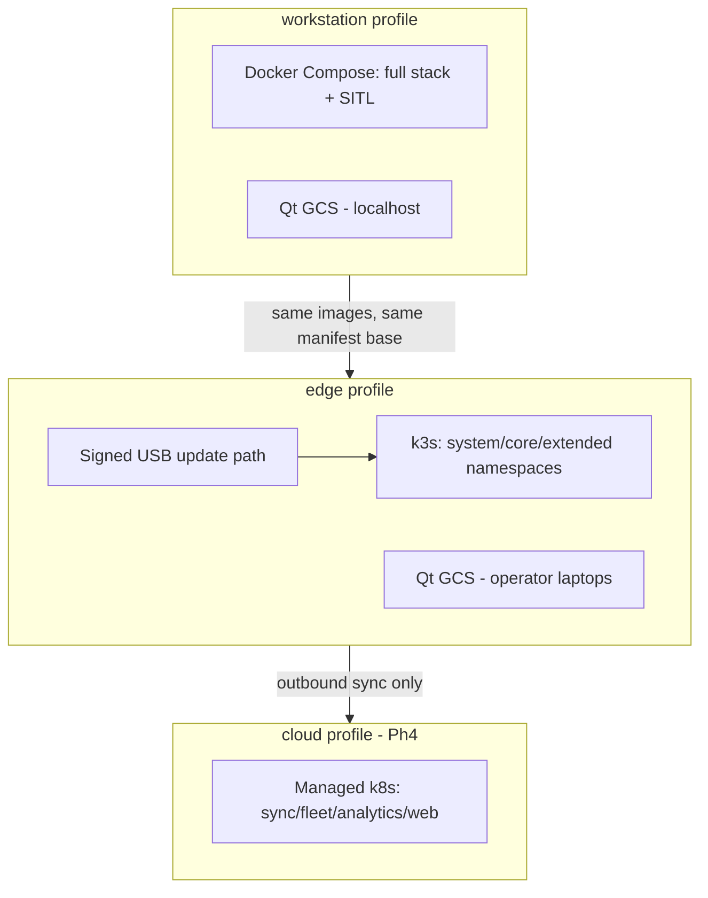

# DEPLOYMENT

**Version 0.1.0 · 2026-07-03 · Three profiles, one manifest lineage (ADR-0011). Installation experience is a product requirement, not an ops afterthought.**

## 1. Profiles

| Profile | Orchestrator | Target | Phase |
|---|---|---|---|
| `workstation` | Docker Compose | Developer machine (RC-1) | 1 |
| `edge` | k3s + Kustomize overlay | Field node (RC-2/RC-3) | 2+ |
| `edge-airgap` | k3s, no sync namespace, egress-deny | Air-gapped node | 2+ |
| `cloud` | Managed k8s + Kustomize overlay | Enterprise tier | 4 |

One Kustomize base under `infrastructure/kubernetes/`; profiles are overlays. Compose files under `infrastructure/docker/compose/` are generated-in-spirit from the same service definitions — a service that exists in one profile exists identically in all (parity checked in CI).

## 2. The installation contract

**Workstation:** `git clone` → `./setup.sh` (or `docker compose up` after prereq check) → working stack with PX4 SITL and a connectable GCS in ≤ 15 minutes on a clean Ubuntu 22.04 machine. This is measured in CI on a pristine container, because "works on the third try after editing four YAMLs" is how robotics stacks die (constitution: unified launcher, unified config).

**Edge:** provisioning ISO/script installs OS hardening + k3s + the signed image bundle; a `node-init` job generates keys, initializes databases, registers the node identity; operator completes a short guided config (site, network segments, air-gap toggle). Target: bootable-to-operational ≤ 1 hour without vendor assistance.

**Cloud:** Terraform under `infrastructure/terraform/` + Kustomize overlay. Standard.

## 3. Runtime layout & configuration

- Config layering per SOFTWARE_ARCHITECTURE.md §6; deployment profile selects the base file; **secrets never in images or config files** (k3s secrets, encrypted at rest; SECURITY.md flow).
- Data on dedicated PVCs: `pg-data`, `ts-data`, `nats-js`, `minio-data` — sized by DATABASE.md retention math; LUKS on edge.
- The Qt GCS is deployed as a native installer (Linux AppImage/deb, Windows MSIX) — versioned with the platform, handshake-checked at connect (API_SPECIFICATION.md §7).

## 4. Update flows

Per EDGE_ARCHITECTURE.md §6 (signed bundle → staged → health-gated rollout → auto-rollback; vehicle-manager veto while flying; USB import path for air-gap with identical signature verification). Cloud updates are ordinary progressive k8s rollouts. Compose/workstation updates are `git pull && ./setup.sh --update` — developers get the same migration jobs, no snowflake state.

## 5. Deployment topology diagram

## 6. Environment matrix & smoke verification

Every deployment ends with a **smoke suite** run automatically (and re-runnable by the operator): service health/readiness across namespaces, NATS stream presence, DB migrations at expected version, SITL loopback flight (workstation) or bridge self-test (edge), gateway auth round-trip, audit-chain head verification, disk watermark status. Result is a signed deployment record — the first entry in that node's audit chain. A deployment without a green smoke record is not "done".

## 7. Failure modes

| Failure | Handling |
|---|---|
| Mid-update power loss (edge) | Staged-then-switch design: previous overlay + images remain until health gates pass; boot resumes rollback |
| Migration failure | Pre-migration snapshot restore + image rollback (EDGE_ARCHITECTURE.md §6) |
| Partial Compose start (workstation) | `setup.sh` health-waits with per-service diagnosis printed — never "up" with dead dependencies |
| Version skew GCS↔node | Handshake refusal with explicit versions and the download pointer |
| Air-gap node needs update, courier lost | Bundles are idempotent and resumable; any signed bundle ≥ current version applies |

## 8. Deliberate exclusions

No Helm (Kustomize covers the need with less templating indirection — revisit only if a customer demands Helm packaging); no auto-update without operator initiation on edge (a field node updating itself before a flight window is an operational hazard, not a convenience); no blue/green on single-node edge (staged-switch-rollback achieves the safety property within one node's resources).
