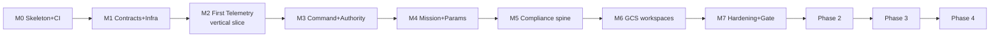

# IMPLEMENTATION_PLAN

**Version 0.1.0 · 2026-07-04 · The executable plan for completing UAOP's development. ROADMAP.md owns phase objectives and exit gates; this document owns the work breakdown, build order, and working method that get there. Stack is locked: Qt 6.8 LTS/QML + C++ (ADR-0002, ADR-0016).**

## 1. Working method (applies to every milestone)

1. **Document → contract → code → test → review → gate.** No service is coded before its MICROSERVICES.md entry and `.proto` contract exist; no milestone closes without its listed proof.
2. **AI-first generation, human-gated integration.** Claude generates against the doc set; every merge passes the full CI gate chain (MISRA, `@req` lint, contract check, SITL smoke). The pipeline, not the generator, is the trust boundary (CI_CD.md §5).
3. **Critical review after every deliverable** — the seven-lens review (DOCUMENTATION_PROCESS.md §4) applies to code milestones exactly as to documents; findings land in DECISIONS.md's Review Log.
4. **`docs/context/phase-N/progress.md`** updated at every working session: installation progress, dependency issues, integration status, review findings, benchmarks, remaining work.
5. **Vertical slices over horizontal layers.** Each milestone ends with something that *runs against SITL*, however thin — never three months of libraries with no flying demo.

## 2. Milestone map (Phase 0 → Phase 1 detailed; later phases summarized)

---

### M0 — Skeleton, toolchain, CI shell *(Phase 0 completion · ~1–2 weeks effort)*

**Objectives:** repo matches PROJECT_STRUCTURE.md; pipelines gate from the first real commit.
**Work items:**
- Create ⊕ directories (PROJECT_STRUCTURE.md): `middleware/mavlink-bridge/` (per OQ-2 recommendation — needs the founder's one-line confirm), `parameter-engine/`, `vehicle-manager/`, `flight-log-engine/`, `simulation-engine/`, `fleet-management/`, `integrations/`, `tools/`, `compliance/tools/`, `infrastructure/kubernetes/`, `.github/workflows/`, `tests/{integration,e2e,hil,data}/`, `docs/compliance/`.
- CMake preset tree + the canonical C++ service template (§ PROJECT_STRUCTURE.md §3) compiling as a hello-service on x86_64 **and ARM64**.
- Qt 6.8 GCS shell: window + docking framework + theme singleton from STYLE_GUIDE tokens, empty panels. Builds on Linux + Windows.
- CI shell: lint → build matrix → placeholder test stage → Trivy — red/green from day one.
- `setup.sh` v0: compose up NATS/PG/Redis/MinIO + PX4 SITL container.
- **Spike (timeboxed 2 days): OQ-3 map stack** — MapLibre Native Qt widget rendering an offline MBTiles/PMTiles extract; decision recorded as ADR.
**DoD:** clean clone → `setup.sh` → infra up; GCS shell opens, connects to nothing gracefully; CI green on both arches; OQ-2/OQ-3 dispositioned in DECISIONS.md.

### M1 — Contracts and platform plumbing *(~2–3 weeks)*

**Objectives:** the data constitution is real; services can speak.
**Work items:**
- `api/proto/`: telemetry v1 (full TELEMETRY_ENGINE.md §2 census), EventEnvelope, error registry, gateway command/query services. `buf` config + breaking-change gate live.
- `services/common/`: `Result<T,E>`, envelope helpers, NATS JetStream client wrapper (durable consumer + dedup pattern), config loader (layered per SOFTWARE_ARCHITECTURE.md §6), structured logger, health/metrics endpoints.
- JetStream streams provisioned per EVENT_FLOW.md §2 (incl. AUDIT with fsync — ADR-0015 semantics).
- api-gateway v0: auth (local JWT + Redis denylist per R1/F5), WebSocket subscription protocol, gRPC forwarding.
- Postgres/Timescale schema baseline + migration harness.
**DoD:** contract tests green; a synthetic publisher → JetStream → gateway → WebSocket test client round-trip works; duplicate-delivery and gap-detection tests pass.

### M2 — First telemetry vertical slice *(~3–4 weeks · the credibility milestone)*

**Objectives:** SITL aircraft visible in the real GCS through the real pipeline.
**Work items:**
- mavlink-bridge v0: UDP link, HEARTBEAT/ATTITUDE/GPS/SYS_STATUS/BATTERY parsing → canonical protobuf → NATS; link state machine; malformed-frame hardening + fuzz harness seed corpus.
- telemetry-engine v0: durable consume → batched Timescale writes; gap events; basic query API.
- vehicle-manager v0: registry, state machine, heartbeat timeout (UAOP-HLR-004).
- GCS: Flight HUD panel (EFIS pair targeting 60 fps — UAOP-NFR-011), map panel (spike result), telemetry strips, staleness visual language end-to-end.
**DoD:** PX4 SITL flies a manual mission; GCS shows live attitude/position/battery at 10 Hz with correct staleness on link kill (≤3 s detect, ≤1 s surface); history query returns the flight; **latency budget instrumented** (UAOP-NFR-002 measured, number recorded in `docs/scaling/`).

### M3 — Command path and authority *(~2–3 weeks)*

**Objectives:** the platform can act, safely, with the full audit story.
**Work items:**
- compliance-engine v0: audit intake (JetStream), hash-chain append, verifier; ADR-0015 admission semantics incl. EMERGENCY WAL fallback in the bridge.
- vehicle-manager: ControlSession model (ADR-0017/UAOP-HLR-005), command authorization, correlation-tracked command results.
- gateway command endpoints + GCS ARM/mode/RTL controls with the command-surface rules (UI_GUIDELINES.md §7) and controlling/observing indicator.
**DoD:** arm/mode/RTL against SITL with ACCEPTED/REJECTED/TIMEOUT semantics demonstrated; two GCS instances demonstrate handover + `NOT_IN_CONTROL` + EMERGENCY override; chain verifier proves completeness across a fault-injection run (Postgres killed mid-campaign — commands keep flowing, chain reconciles).

### M4 — Mission and parameter engines *(~3–4 weeks)*

- mission-engine: plan model, validation pipeline (structural/dialect/geometric), verified transfer (upload→download→byte-verify→hash audit), geofence upload + breach surfacing.
- parameter-engine: full-table read, metadata packs (PX4 v1.14 + ArduPilot 4.5 initial), validated/ACK'd/versioned writes, mid-flight HIGH-risk refusal policy.
- GCS: Mission editor, Parameters panel, Geofence manager, Fail-safe config.
**DoD:** ROADMAP Phase 1 gate items 2, 3, 5 demonstrable; ArduPilot SITL added to the matrix (dual-stack routing proven).

### M5 — Compliance spine completes Phase 1 scope *(~2–3 weeks)*

- remote-id: broadcast-state tracking, 1 Hz cycle evidence, mandatory-field panel.
- flight-log-engine: download (SITL), hash-at-capture, MinIO library, export.
- compliance-engine: 30-item pre-flight checklist + AUTHORISE gate + signed sign-off; audit export bundle (self-verifying).
- GCS: Checklist, Remote ID, Logs, Audit viewer, Node status panels.
**DoD:** gate items 4, 7 demonstrable; disconnect (air-gap) test passes for everything built so far.

### M6 — GCS workspaces and operator polish *(~2 weeks)*

- Workspace persistence (FLIGHT OPS / REVIEW / COMPLIANCE), multi-monitor tear-off, alert stack + master caution per UX_GUIDELINES.md §2, keyboard map, fleet cards (edge tier, 5 vehicles).
**DoD:** UAOP-NFR-011 measured; a QGC-fluent pilot completes the golden path unassisted (UX_GUIDELINES.md §7 test, recorded).

### M7 — Hardening and the Phase 1 validation gate *(~2–3 weeks)*

- Full VALIDATION.md §3 matrix automated in `tests/sitl/`; 24 h soak; 1000 Hz ingest benchmark (ARM64 native); fuzz campaign review; five-layer validation evidence assembled in `docs/context/phase-1-validation/`; PSAC/SDP/SCMP skeletons finalized; RTM ≥ 20 HLRs traced.
**Exit = ROADMAP.md Phase 1 gate, all ten criteria green.** Anything red blocks Phase 2 — no exceptions without a written waiver.

---

### Phases 2–4 (summary — detailed WBS authored at each phase start, same format)

| Phase | Milestone spine | Authored when |
|---|---|---|
| 2 | M8 tuning loop → M9 ai-engine (flightmd_core) → M10 ros2-bridge + workspace → M11 SORA/BVLOS → M12 edge k3s profile + bench HIL → gate | at Phase 1 exit (with OQ-1, OQ-6 decisions) |
| 3 | M13 simulation-engine + scenarios → M14 certification runner → M15 digital twin T0/T1 → M16 training scoring → M17 50-vehicle + 1 kHz scale proof → gate | at Phase 2 exit |
| 4 | M18 fleet + cloud sync → M19 SDK + marketplace → M20 UTM live → M21 security hardening + external pentest → M22 DO-178C package + design partner pilot → gate | at Phase 3 exit (OQ-4/OQ-5 resolved) |

Estimated Phase 1 total: **~4–5 months** of focused effort at solo-founder-plus-AI cadence (R-4 honesty: calendar time stretches if job commitments compete; the milestone structure survives interruption because every milestone lands on a runnable state).

## 3. Critical path and parallelization notes

The critical path is M1→M2→M3 (contracts → telemetry → command): everything else hangs off it. Parallel-safe at any point: GCS panel construction against recorded fixtures (TESTING.md §5), metadata packs, documentation, map spike. **Not** parallel-safe: anything touching `api/proto/` after M1 freeze (additive-only discipline starts there), and the audit chain semantics after M3 (DAL C-equivalent scope — changes go through review).

## 4. First session checklist (literally where to start)

1. Founder confirms OQ-2 (create `middleware/mavlink-bridge/`) — one line.
2. Commit this documentation baseline.
3. M0 items in order: directories → CMake presets + service template → CI shell → `setup.sh` v0 → GCS shell → map spike.
4. Open `docs/context/phase-1/progress.md` with the M0 checklist and start ticking.
