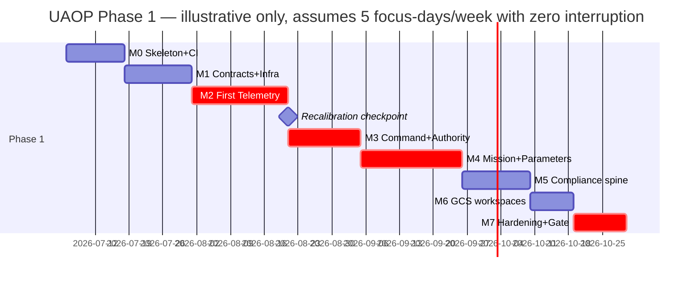

# IMPLEMENTATION_PLAN

**Version 0.2.2 · 2026-07-07 · The executable plan for completing UAOP's development. ROADMAP.md owns phase objectives and exit gates; this document owns the work breakdown, effort estimates, sequencing, and working method that get there. Stack is locked: Qt 6.8 LTS/QML + C++ (ADR-0002, ADR-0016).**

**Changelog:** v0.2.0 expanded v0.1.0 from milestone-level objectives into a task-level work breakdown structure (WBS) with effort estimates, dependency IDs, requirement/risk traces, a timeline, and per-milestone Definition of Ready/Done — produced after Review R3, whose findings are already folded into the WBS below (RTM tooling moved earlier, continuous fuzzing wired into CI from M0, frozen-directory guard scheduled, SITL coverage distributed across milestones instead of backloaded to M7, and a mid-phase recalibration checkpoint added). v0.2.1 folds in Review R4 / ADR-0018 (see [DECISIONS.md](../00_Project_Foundation/DECISIONS.md)): the real, live `flightmd_core` dependency de-risks and reshapes parts of M2/M4/Phase 2, and two of its non-code assets are now seeded in-repo ahead of schedule. v0.2.2 folds in Review R5 / **ADR-0019** (license-tiered upstream code reuse): PX4 (BSD) and QGC (Apache option, per-file verified) code may be ported with provenance — the protocol transfer state machines in M4.2/M4.4 now start from QGC's battle-tested logic instead of blank pages; ArduPilot/Mission Planner (GPLv3) are behavioral references only, never in-tree; M0.5 gains an in-PR license-allowlist gate.

---

## 0. Status snapshot (read this first)

| Item | State |
|---|---|
| Documentation | 47 docs baselined + amended (`docs/00_…08_`), pushed to `main` at `github.com/Praddyx15/UAOP` |
| Reviews | R1 (12 findings → ADR-0015/16/17), R2 (7 findings → workspace cleanup + OQ-2 resolved), R3 (this plan — see below) |
| Repository structure | Full PROJECT_STRUCTURE.md tree created; FROZEN.md guards on `dji-service/`/`fpv-service/` |
| Code | **One asset exists**: a Qt 6/C++20 GCS prototype (`frontend/qt-desktop-gcs/`) — CMake build, `TelemetryController`, 4 QML views. Kept as the M0 seed (R2/F13); everything else in this plan is unbuilt |
| Open questions blocking nothing yet | OQ-1 (dji/fpv scope, Phase 2), OQ-3 (map spike, M0), OQ-4/OQ-5 (licensing/pricing, Phase 4), OQ-6/OQ-7 (Phase 2/4) |
| Current milestone | **M0**, not started |

## 1. Working method (applies to every milestone — unchanged from v0.1.0)

1. **Document → contract → code → test → review → gate.** No service is coded before its MICROSERVICES.md entry and `.proto` contract exist; no milestone closes without its listed proof.
2. **AI-first generation, human-gated integration.** Claude generates against the doc set; every merge passes the full CI gate chain (MISRA, `@req` lint, contract check, SITL smoke). The pipeline, not the generator, is the trust boundary (CI_CD.md §5).
3. **Critical review after every deliverable** — the seven-lens review (DOCUMENTATION_PROCESS.md §4) applies to code milestones exactly as to documents; findings land in DECISIONS.md's Review Log.
4. **`docs/context/phase-N/progress.md`** updated at every working session: installation progress, dependency issues, integration status, review findings, benchmarks, remaining work.
5. **Vertical slices over horizontal layers.** Each milestone ends with something that *runs against SITL*, however thin — never three months of libraries with no flying demo.

## 2. Capacity model and how to read the estimates

**Unit: focus-day** ≈ 4–6 hours of uninterrupted implementation work (solo founder + AI-assisted generation). This is not a calendar day — [RISK_REGISTER R-4](../00_Project_Foundation/RISK_REGISTER.md) already flags that job-hunting and other commitments compete for time. Three cadence scenarios convert focus-days to calendar time; **pick the one matching your actual availability this month, don't assume the aggressive one**:

| Cadence | Focus-days/week | Phase 1 (115 focus-days) calendar time |
|---|---|---|
| Aggressive (near full-time) | 5 | ~23 weeks (~5.3 months) |
| Sustainable (part-time alongside other work) | 3 | ~38 weeks (~8.8 months) |
| Conservative (interrupted, realistic worst case) | 2 | ~58 weeks (~13.3 months) |

**Estimates are architect judgment, not measured data** (Review R3/F22) — the first real calibration point is milestone M2 (task M2.10 below); after it, recompute M3–M7 from actual time spent rather than trusting the numbers here.

**Tracking mechanism:** this WBS's task IDs (M0.1, M1.4, …) map 1:1 onto `TaskCreate`/`TaskUpdate` tool tasks when a coding session starts; `docs/context/phase-1/progress.md` is the durable cross-session record — update it at the end of every session, not just at milestone boundaries.

**Bench tasks (Review R3/F23):** the critical path M1→M2→M3→M4→M5 is fully serial — a 3–4 week interruption to core-path work stalls the whole chain. These tasks have no upstream dependency and can absorb interrupted time without blocking anything: metadata-pack authoring (ArduPilot 4.5 parameter docs — PX4 is now seeded, see M4.4), SITL scenario library seeding (Phase 3 prep, low urgency but zero-dependency), documentation refinement, GCS visual polish against recorded fixtures (TESTING.md §5), and — new (R4/ADR-0018) — **Git LFS setup + curated subset import** from FlightMD's 8.5 GB real-world validation corpus (50 real PX4 logs, 11 vehicle types) into `tests/data/`, which would materially strengthen Phase 2's ai-engine testing and Phase 1's own telemetry/log-parsing robustness testing whenever it happens. Keep one in flight as a fallback when core-path time isn't available.

## 3. Milestone map

**Total Phase 1: ≈115 focus-days.** GCS panel construction (M0.4 onward) and documentation are parallel-safe against the M1→M2→M3 spine; everything else is serial (§7).

## 4. Illustrative timeline (aggressive cadence — recalibrate after M2)

---

## 5. Detailed Work Breakdown Structure

Table columns: **ID** · **Task (deliverable folded in)** · **Effort** (focus-days) · **Depends on** · **Trace** (requirement/ADR/risk this task satisfies or retires).

### M0 — Skeleton, toolchain, CI + compliance-tooling shell

**Definition of Ready:** Phase 0 documentation baseline merged to `main` (done). **Definition of Done:** clean clone → `setup.sh` → infra up; GCS shell opens and connects to nothing gracefully; CI green on both arches; OQ-3 dispositioned as an ADR; RTM generator produces an (empty but valid) report.

| ID | Task | Effort | Depends on | Trace |
|---|---|---|---|---|
| M0.1 | Root `CMakePresets.json`: debug/release × x86_64/arm64 × sanitizer variant | 0.5d | — | ADR-0016 |
| M0.2 | `.clang-format`, `.clang-tidy`, MISRA C++:2023 Cppcheck config skeleton | 0.5d | — | CODING_STANDARDS.md, ADR-0016 |
| M0.3 | `services/common/` skeleton + one hello-service instantiation | 1d | M0.1 | MICROSERVICES.md, PROJECT_STRUCTURE.md §3 |
| M0.4 | Qt GCS panel-host framework: workspace manager, docking, panel manifest loader, Theme singleton from STYLE_GUIDE tokens; migrate the 4 existing prototype views into panel modules | 3d | — (parallel-safe) | UI_GUIDELINES.md §2/§6, STYLE_GUIDE.md §9, Review R2/F13 |
| M0.5 | CI shell: lint → build matrix → placeholder test → Trivy, **plus** frozen-directory guard (fails on any file in `dji-service/`/`fpv-service/` other than FROZEN.md — R3/F24) **plus** nightly fuzz-job stub (empty corpus until M2.3 seeds it — R3/F21) **plus** link/ADR-reference checkers (DOCUMENTATION_PROCESS.md §6) **plus** in-PR license-allowlist gate + GPL-text denylist + `THIRD_PARTY_NOTICES.md` mechanism (R5/F35, ADR-0019) | 2d | M0.1–M0.3 | CI_CD.md §1/§5, PROJECT_STRUCTURE.md §2, ADR-0019 |
| M0.6 | `setup.sh` v0: compose up NATS/PG/Redis/MinIO + PX4 SITL container | 1d | M0.3 | DEPLOYMENT.md §2 |
| M0.7 | **OQ-3 spike (timeboxed):** MapLibre Native Qt widget rendering an offline MBTiles/PMTiles extract; decision recorded as an ADR | 2d | M0.4 | ADR-0008, RISK_REGISTER R-11 |
| M0.8 | `compliance/tools/rtm-generator` scaffold + `@req` annotation lint wired into CI — **moved up from M7** (R3/F20): traceability is never retrofitted, so the tool that proves it must exist before the first flight-influencing commit (M2), not after the last one | 1.5d | M0.5 | UAOP-NFR-009, COMPLIANCE.md §A.3, ADR-0010 |
| **M0 total** | | **11.5d** | | |

### M1 — Contracts and platform plumbing

**DoR:** M0 complete. **DoD:** contract tests green; a synthetic publisher → JetStream → gateway → WebSocket test client round-trip works; duplicate-delivery and gap-detection tests pass.

| ID | Task | Effort | Depends on | Trace |
|---|---|---|---|---|
| M1.1 | `api/proto/uaop/telemetry/v1/`: full census (position/attitude/velocity/imu/ekf/battery/esc/rc/link/rf/health/state/remoteid) + `TelemetrySnapshot`/`TelemetryDelta`; `buf` config + breaking-change gate live | 2d | M0 | TELEMETRY_ENGINE.md §2, ADR-0009 |
| M1.2 | `EventEnvelope` + platform error-code registry proto | 0.5d | M1.1 | EVENT_FLOW.md §4 |
| M1.3 | `api/proto/uaop/gateway/v1/`: command/mission/parameter/telemetry_query/log/compliance services | 1d | M1.2 | API_SPECIFICATION.md §6 |
| M1.4 | `services/common/` runtime library: `Result<T,E>`, envelope helpers, NATS JetStream client (durable consumer + dedup pattern), layered config loader, structured logger, health/metrics endpoints | 3d | M1.1–M1.3 | SOFTWARE_ARCHITECTURE.md §5, LOGGING.md §2, OBSERVABILITY.md |
| M1.5 | JetStream stream provisioning (TELEMETRY/EVENTS/COMMANDS/AI/AUDIT) with AUDIT fsync-on-write semantics | 1d | M1.4 | EVENT_FLOW.md §2, ADR-0015 |
| M1.6 | `api-gateway` v0: local JWT auth + Redis denylist (≤60 min tokens, R1/F5), WebSocket subscription protocol, gRPC forwarding | 3d | M1.3–M1.4 | SECURITY.md §3, API_SPECIFICATION.md §5 |
| M1.7 | Postgres/Timescale schema baseline + migration harness (schema-per-service isolation) | 2d | M1.4 | DATABASE.md §2/§5 |
| M1.8 | Idempotency test harness: duplicate-delivery test, gap-detection test, out-of-order test | 1d | M1.4–M1.7 | EVENT_FLOW.md §3, TESTING.md §2.1 |
| **M1 total** | | **13.5d** | | |

### M2 — First telemetry vertical slice (the credibility milestone)

**DoR:** M1 complete. **DoD:** PX4 SITL flies a manual mission; GCS shows live attitude/position/battery at 10 Hz with correct staleness on link kill (≤3 s detect, ≤1 s surface); history query returns the flight; latency budget measured and recorded.

| ID | Task | Effort | Depends on | Trace |
|---|---|---|---|---|
| M2.1 | `middleware/mavlink-bridge` v0: UDP link, HEARTBEAT/ATTITUDE/GPS_RAW_INT/SYS_STATUS/BATTERY_STATUS parsing → canonical protobuf → NATS publish | 4d | M1 | MAVLINK_INTEGRATION.md §1–3 |
| M2.2 | Link state machine + heartbeat timeout detection | 1d | M2.1 | UAOP-HLR-004 |
| M2.3 | Malformed-frame hardening + libFuzzer harness seed corpus, wired into the M0.5 nightly fuzz job (closes R3/F21). Seed corpus now includes the `tests/data/sample_logs/sample_{clean,flawed}.tlog` MAVLink message-stream fixtures imported from FlightMD (R4/ADR-0018) as replayable input alongside the fuzzer's own generated frames | 2d | M2.1, M0.5 | MAVLINK_INTEGRATION.md §6, SECURITY.md §7 |
| M2.4 | `telemetry-engine` v0: durable consume → batched Timescale writes, gap events, basic query API | 3d | M1.7, M2.1 | TELEMETRY_ENGINE.md §3–5 |
| M2.5 | `vehicle-manager` v0: registry, connection state machine | 2d | M2.1 | UAOP-HLR-002 |
| M2.6 | GCS Flight HUD panel: EFIS pair (60 fps target), speed/altitude tapes, staleness visual language wired to real C++ models (not fixtures) | 4d | M0.4, M2.4 | UI_GUIDELINES.md §3, UX_GUIDELINES.md §3, UAOP-NFR-011 |
| M2.7 | GCS Map panel using the M0.7 spike output + telemetry strips | 2d | M0.7, M2.4 | UI_GUIDELINES.md §3 |
| M2.8 | Latency instrumentation across the hot path; first UAOP-NFR-002 measurement recorded to `docs/scaling/` | 1d | M2.1–M2.6 | DATA_FLOW.md §3 |
| M2.9 | `tests/sitl/`: telemetry-rate and link-loss coverage added (distributed from M7 — closes R3/F25) | 1d | M2.1–M2.5 | VALIDATION.md §3 |
| M2.10 | **Recalibration checkpoint:** compare actual vs. estimated effort for M0–M2; adjust M3–M7 estimates in this document before proceeding (closes R3/F22) | 0.25d | M2.1–M2.9 | — |
| **M2 total** | | **20.25d** | | |

### M3 — Command path and authority

**DoR:** M2 complete, M2.10 recalibration done. **DoD:** arm/mode/RTL against SITL with ACCEPTED/REJECTED/TIMEOUT semantics demonstrated; two GCS instances demonstrate handover + `NOT_IN_CONTROL` + EMERGENCY override; chain verifier proves completeness across a fault-injection run (Postgres killed mid-campaign — commands keep flowing, chain reconciles).

| ID | Task | Effort | Depends on | Trace |
|---|---|---|---|---|
| M3.1 | `compliance-engine` core: audit intake consumer, SHA-256 hash-chain append (single writer), verifier | 3d | M1.5 | COMPLIANCE.md §B.3, DATABASE.md §3 |
| M3.2 | ADR-0015 admission semantics: JetStream-persisted event = command admission gate; async Postgres append with lag metric; EMERGENCY command class WAL + reconciler in mavlink-bridge | 3d | M3.1, M2.1 | ADR-0015, EDGE_ARCHITECTURE.md |
| M3.3 | `vehicle-manager`: ControlSession model, command authorization, correlation-tracked command results | 3d | M2.5, M3.1 | ADR-0017, UAOP-HLR-005 |
| M3.4 | Gateway command endpoints (ARM/DISARM/mode/RTL) with ACCEPTED/REJECTED/TIMEOUT semantics | 2d | M3.2–M3.3 | API_SPECIFICATION.md §4 |
| M3.5 | GCS command surface: ARM/mode/RTL controls per the command-surface rule (UI_GUIDELINES.md §7), controlling/observing indicator | 2d | M3.4 | UI_GUIDELINES.md §7 |
| M3.6 | Fault-injection test: kill Postgres mid-campaign, verify commands keep flowing and chain reconciles | 1d | M3.2 | VALIDATION.md §3 |
| M3.7 | `tests/sitl/`: command-authority and audit-chain coverage added (R3/F25) | 1d | M3.1–M3.5 | VALIDATION.md §3 |
| **M3 total** | | **15d** | | |

### M4 — Mission and parameter engines

**DoR:** M3 complete. **DoD:** ROADMAP Phase 1 gate items 2, 3, 5 demonstrable; ArduPilot SITL added to the matrix (dual-stack routing proven).

| ID | Task | Effort | Depends on | Trace |
|---|---|---|---|---|
| M4.1 | `mission-engine` domain model + validators (structural/dialect/geometric/energetic) | 3d | M1.7, M3.1 | MISSION_ENGINE.md §2–3 |
| M4.2 | Verified transfer: upload → download → byte-verify → hash audit event. Transfer/retry state machine **ported from QGC's `MissionManager` logic** (Apache-2.0 option, per-file verified, provenance headers + notices entry — ADR-0019) into our `Result<T,E>`/no-exception idiom, rather than hand-rolled from the MAVLink spec alone | 3d | M4.1, M2.1 | MISSION_ENGINE.md §4, ADR-0019 |
| M4.3 | Geofence upload + breach event capture | 2d | M4.2 | MISSION_ENGINE.md §6 |
| M4.4 | `parameter-engine`: full-table read, PX4 v1.14 + ArduPilot 4.5 metadata packs, validated/ACK'd/versioned writes. **De-risked twice**: (R4/ADR-0018) PX4 v1.13/v1.14 default-parameter and safe-range JSON already seeded at `backend/services/parameter-engine/data/` from FlightMD; (R5/ADR-0019) full PX4 parameter metadata sourced from PX4-Autopilot's published machine-readable definitions (BSD, Tier 1), ArduPilot metadata from its published parameter-definition *data* (facts, consumed as every GCS does), and the parameter I/O retry logic referenced from QGC's `ParameterManager` (Tier 2, ported not pasted) | 4d | M2.1, M1.7 | PRODUCT_REQUIREMENTS UAOP-HLR-020/021, ADR-0019 |
| M4.5 | Mid-flight HIGH-risk write refusal policy | 1d | M4.4, M3.3 | TUNING_ENGINE.md §4 (write-risk classes) |
| M4.6 | GCS Mission editor + Parameters panel + Geofence manager + Fail-safe config panels | 5d | M4.1–M4.5, M0.4 | UI_GUIDELINES.md §3 |
| M4.7 | ArduPilot SITL added to the CI matrix; dual-stack routing test | 2d | M2.1 | MAVLINK_INTEGRATION.md §2 |
| M4.8 | `tests/sitl/`: mission-transfer and parameter-write coverage added (R3/F25) | 1d | M4.1–M4.5 | VALIDATION.md §3 |
| **M4 total** | | **21d** | | |

### M5 — Compliance spine completes Phase 1 scope

**DoR:** M4 complete. **DoD:** ROADMAP gate items 4, 7 demonstrable; disconnect (air-gap) test passes for everything built so far.

| ID | Task | Effort | Depends on | Trace |
|---|---|---|---|---|
| M5.1 | `remote-id`: broadcast-state tracking, 1 Hz cycle evidence | 2d | M2.1, M3.1 | UAOP-HLR-040 |
| M5.2 | `flight-log-engine`: SITL log download, hash-at-capture, MinIO library, export | 3d | M2.1 | UAOP-HLR-031/032 |
| M5.3 | 30-item pre-flight checklist + AUTHORISE gate + signed sign-off | 2d | M3.1 | UAOP-HLR-043 |
| M5.4 | Audit export bundle (self-verifying) | 1d | M3.1 | COMPLIANCE.md §B.3 |
| M5.5 | GCS Checklist / Remote ID / Logs / Audit-viewer / Node-status panels | 4d | M5.1–M5.4, M0.4 | UI_GUIDELINES.md §3 |
| M5.6 | Air-gap disconnect test across everything built in M0–M5 | 1d | M5.1–M5.5 | UAOP-NFR-001, SECURITY.md §6 |
| M5.7 | OQ-1 checkpoint: re-verify the frozen-directory CI guard (M0.5) still holds before Phase 2 planning touches dji/fpv scope (R3/F24) | 0.25d | M0.5 | PROJECT_STRUCTURE.md §2 |
| M5.8 | `tests/sitl/`: remote-id, log-capture, and checklist coverage added (R3/F25) | 1d | M5.1–M5.5 | VALIDATION.md §3 |
| **M5 total** | | **14.25d** | | |

### M6 — GCS workspaces and operator polish

**DoR:** M5 complete. **DoD:** UAOP-NFR-011 measured; a QGC-fluent pilot completes the golden path unassisted.

| ID | Task | Effort | Depends on | Trace |
|---|---|---|---|---|
| M6.1 | Workspace persistence (FLIGHT OPS / REVIEW / COMPLIANCE), multi-monitor tear-off | 3d | M0.4 | UI_GUIDELINES.md §2 |
| M6.2 | Alert stack + master caution per UX_GUIDELINES.md §2 | 2d | M3.5, M5.5 | UX_GUIDELINES.md §2 |
| M6.3 | Keyboard map | 1d | M6.1 | UX_GUIDELINES.md §7 |
| M6.4 | Fleet cards (edge tier, 5 vehicles) | 2d | M2.5 | UAOP-HLR-070 (edge subset) |
| M6.5 | UAOP-NFR-011 measurement + operator usability test (QGC-fluent pilot golden path, recorded) | 1d | M6.1–M6.4 | UX_GUIDELINES.md §7 |
| **M6 total** | | **9d** | | |

### M7 — Hardening and the Phase 1 validation gate

**DoR:** M6 complete. **DoD/Exit = ROADMAP.md Phase 1 gate, all ten criteria green.** Anything red blocks Phase 2 — no exceptions without a written waiver.

| ID | Task | Effort | Depends on | Trace |
|---|---|---|---|---|
| M7.1 | Assemble and verify the full VALIDATION.md §3 matrix in `tests/sitl/` — lighter than originally planned since M2.9/M3.7/M4.8/M5.8 already built the per-engine coverage incrementally (R3/F25) | 2d | M2.9, M3.7, M4.8, M5.8 | VALIDATION.md §3 |
| M7.2 | 24 h soak test | 1d | M7.1 | UAOP-NFR-005 |
| M7.3 | 1000 Hz ingest benchmark, ARM64 native hardware | 2d | M2.4 | UAOP-NFR-003, HARDWARE_ARCHITECTURE.md |
| M7.4 | Fuzz campaign review — corpus has matured since M2.3 seeded it into the nightly job (R3/F21) | 1d | M2.3 | SECURITY.md §7 |
| M7.5 | Five-layer validation evidence assembled in `docs/context/phase-1-validation/` | 2d | M7.1–M7.4 | VALIDATION.md §1 |
| M7.6 | PSAC/SDP/SCMP skeletons finalized | 2d | — (parallel-safe, documentation) | COMPLIANCE.md §A.3 |
| M7.7 | RTM ≥ 20 HLRs traced — verification only; the generator has existed since M0.8 (R3/F20) | 0.5d | M0.8 | UAOP-NFR-009 |
| **M7 total** | | **10.5d** | | |

**Phase 1 grand total: 11.5 + 13.5 + 20.25 + 15 + 21 + 14.25 + 9 + 10.5 = 115 focus-days.**

---

## 6. Phases 2–4 (order-of-magnitude only — detailed WBS authored at each phase start, same method as above)

| Phase | Milestone spine | Rough effort | Authored when |
|---|---|---|---|
| 2 | M8 tuning loop → M9 ai-engine (flightmd_core) → M10 ros2-bridge + workspace → M11 SORA/BVLOS → M12 edge k3s profile + bench HIL → gate | ~90–110 focus-days — **M9 is now de-risked** (R4/ADR-0018): the dependency is real, live, MIT-licensed, and independently validated against 50 real-world logs; M9's job shrinks to writing the integration wrapper (pin version, no-`AIEnhancer`-by-default policy, `ASCENT_PROFILE` category filter) rather than validating an unproven analysis engine | at Phase 1 exit (with OQ-1, OQ-6 decisions) |
| 3 | M13 simulation-engine + scenarios → M14 certification runner → M15 digital twin T0/T1 → M16 training scoring → M17 50-vehicle + 1 kHz scale proof → gate | ~100–130 focus-days | at Phase 2 exit |
| 4 | M18 fleet + cloud sync → M19 SDK + marketplace → M20 UTM live → M21 security hardening + external pentest → M22 DO-178C package + design partner pilot → gate | ~130–170 focus-days (includes external audit/consultant time, not just founder effort) | at Phase 3 exit (OQ-4/OQ-5 resolved) |

These ranges are architect judgment calibrated against Phase 1's WBS density, not independent estimates — treat them as planning inputs to revisit, not commitments.

## 7. Critical path and parallelization notes

The critical path is **M1 → M2 → M3 → M4 → M5** (contracts → telemetry → command → mission/params → compliance); M6/M7 depend on all of it. Parallel-safe at any point: GCS panel construction against recorded fixtures (TESTING.md §5) once M0.4's panel-host framework exists, metadata-pack authoring, documentation, the OQ-3 map spike, and the bench-task list in §2. **Not parallel-safe:** anything touching `api/proto/` after M1's additive-only freeze, and audit-chain semantics after M3 (DAL C-equivalent scope — changes go through review, not ad hoc edits).

## 8. How to run a milestone (the repeatable execution loop)

1. **Check DoR** for the milestone — if not met, finish the blocking predecessor first.
2. **Load the milestone's WBS tasks** into `TaskCreate` at session start; mark `in_progress`/`completed` as you go — don't batch updates.
3. **Generate against the doc set**, not from memory — the milestone's "Trace" column names the exact document section that is the source of truth for each task.
4. **Run the seven-lens critical review** on each non-trivial deliverable (§1 rule 3); log findings in DECISIONS.md in the same session, don't defer.
5. **Update `docs/context/phase-1/progress.md`** before ending the session: what's done, what's blocked, what was found.
6. **Check DoD** before declaring the milestone closed — partial credit doesn't advance the milestone map.

## 9. Next session checklist (where to start right now)

1. Open `docs/context/phase-1/progress.md` — read the latest entry first.
2. Confirm M0's Definition of Ready (already met — documentation baseline is on `main`).
3. Start with M0.1–M0.3 (toolchain + service template) since M0.4 (GCS) and M0.7 (map spike) both need decisions those tasks don't block on — order within M0 is flexible, but M0.5's frozen-directory guard should land before any service code is written elsewhere in the tree.
4. Load the M0 WBS rows into `TaskCreate` and begin.
