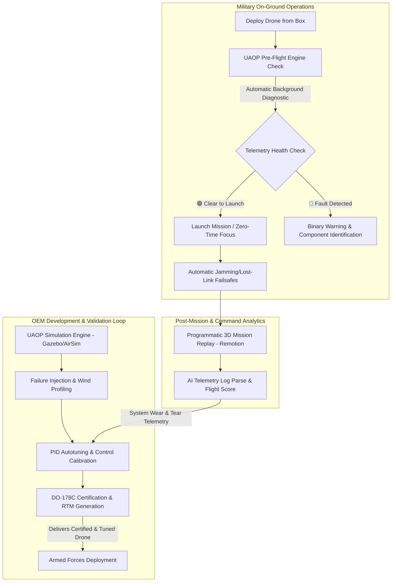

# UAOP Defense Value Proposition: OEM to On-Ground Operations

This document establishes the strategic and technical value of the **Unified Autonomy Operating Platform (UAOP)** in defense and military applications. It details how UAOP bridges the gap between complex R&D tuning required by Original Equipment Manufacturers (OEMs) and the zero-diagnostics, high-reliability requirements of on-ground operators.

---

## 🔄 The Dual-Workflow Ecosystem (Mermaid Flowchart)

The flowchart below illustrates how UAOP divides tasks: the OEM manages deep optimization, calibration, and validation, while the soldier in the field interacts only with simple, deterministic operational controls.



---

## 🏢 1. Why UAOP is Ideal for OEMs (Drone Builders)

OEMs (such as Enrod, Falco, etc.) are contracted to deliver reliable products. R&D is their responsibility. UAOP provides the tooling to move from an idea to a certified, combat-ready product:

1. **Rigorous Simulation & Testing (SITL/HITL)**
   * OEMs can run thousands of simulated hours in Gazebo (for swarm physics) and AirSim (for vision model training) before physical prototyping, reducing physical crashes and R&D costs.
2. **Deterministic Failure Injection**
   * UAOP provides APIs to programmatically simulate hardware errors (e.g., motor cuts, sensor drift, GPS jamming). This allows OEMs to prove that their emergency failsafes work under combat conditions.
3. **DO-178C Certification Tools**
   * To sell to the defense sector, software must be certified. UAOP simplifies this by auto-generating Requirements Traceability Matrices (RTM) and testing logs matching software lines directly to aviation standards.
4. **MISRA C++ Control System Compliance**
   * Core telemetry services adhere to MISRA standards (no dynamic memory allocation at runtime), eliminating memory leaks and unpredictable latency spikes during flight.

---

## 🪖 2. Why UAOP is Ideal for On-Ground Military Applications (The Soldier)

Soldiers on the ground operate in high-stress, time-sensitive scenarios. They require tools that demand zero diagnosis and are ready to execute:

1. **Zero-Diagnostics Pre-Flight Health Indicator**
   * Instead of exposing pages of raw graphs and numerical sensor telemetry, UAOP condenses everything into a simple binary status: **🟢 READY TO FLY** or **🔴 NO-GO**. 
   * If there is a fault, it explicitly names the component (e.g., "🔴 Battery Cell Unbalance - Replace Pack") so the soldier can resolve it instantly without debugging.
2. **Automatic Jam-Resistant & Safe Return Failsafes**
   * When subject to signal jamming, UAOP nodes automate return-to-launch (RTL) routes and safety envelopes (like geofences and ASTM F3322 parachute deployment logic) without requiring pilot intervention.
3. **Programmatic Mission Replays & Incident Auditing**
   * In the event of a crash or lost drone, UAOP reconstructs the telemetry logs into a 3D visual playback using `Remotion`. Command officers can watch a video replay of the flight path and receive a clear text report (e.g., "Left motor lost power at 15:34:02") instead of reading binary logs.
4. **No-takeoff Geofencing & Airspace Compliance**
   * The platform enforces DGCA NPNT (No Permission, No Takeoff) and Part 107 geofencing automatically. Drones verify operational permissions digitally before allowing motors to arm, preventing unauthorized operations or flights into restricted sectors.


Listed directory uaop-platform
Viewed CLAUDE.md:1-39
Listed directory docs
Viewed progress.md:1-55
Viewed uaop_architecture_guide.md:1-365
Listed directory 44eb8595-106e-4c25-8f30-75946f0f739f
Viewed compliance.md:1-27

Here is the complete status of the project, a detailed task checklist of what is done vs. what is left, and the strategic positioning of how UAOP directly solves the exact problem raised by your interviewer.

---

### 🛡️ Strategic Alignment: How UAOP Serves Defense & The Army

The interviewer's feedback is **100% correct regarding ground operations**: Soldiers in active combat/recon missions do **not** have the time, training, or inclination to tune PIDs, look at telemetry graphs, or perform diagnostics. They need a tool that is ready to fly out of the box, execute the mission, and pack back up.

However, **UAOP is the bridge that makes this "substandard-to-reliable product" journey possible** for both the OEM (the builder) and the Army (the operator):

```
┌─────────────────────────────────────────────────────────────────────────┐
│                          DEVELOPMENT & VALIDATION                       │
│    OEM Developers (e.g., Enrod) use UAOP to tune, simulate, and audit   │
└────────────────────────────────────┬────────────────────────────────────┘
                                     │ (Builds Bulletproof Reliability)
                                     ▼
┌─────────────────────────────────────────────────────────────────────────┐
│                          OPERATIONAL MISSION                            │
│      Soldiers use UAOP's simplified HUD: "READY/NOT READY TO FLY"       │
└─────────────────────────────────────────────────────────────────────────┘
```

#### 1. Zero-Time Pre-Flight Assurance (For the Soldier)
* **The Problem:** The soldier cannot spend 5 minutes diagnosing a drone to see if it is ready.
* **The UAOP Solution:** Instead of showing raw data streams, UAOP's **AI Diagnostics & Compliance Engine** runs background checks on all sensors (IMU, compass, battery cell consistency, motor state, GPS quality). It displays a single, high-contrast, binary status:
  * **🟢 READY TO FLY** (All systems green).
  * **🔴 NO-GO: [Specific Fault]** (e.g., "🔴 NO-GO: Compass interference detected").
  * This gives the operator instant, readable assurance without requiring R&D knowledge.

#### 2. Bulletproof Reliability Engineering (For the OEM)
* **The Problem:** The Army demands a highly reliable product, not an R&D project.
* **The UAOP Solution:** OEMs cannot deliver reliability without deep testing. UAOP provides the testing harness. By using UAOP's **Simulation & Failure Injection Engines**, the OEM can programmatically inject motor failures, GPS jamming, and extreme wind gusts to prove that the autopilot's failsafe logic behaves predictably before delivery. 

#### 3. Automatic Mission Safety & Failsafes (During Operations)
* **The Problem:** In defense scenarios, manual error or signal jamming is a primary cause of drone loss.
* **The UAOP Solution:** UAOP automates emergency compliance in the background (like [ASTM F3322](file:///c:/Users/akass/Desktop/UAOP/uaop-platform/docs/compliance.md#L24-L26) parachute deployment logic if the drone rolls $>70^\circ$, and return-to-launch routes when telemetry link is lost). The soldier does not have to think about failsafes; the platform executes them natively.
