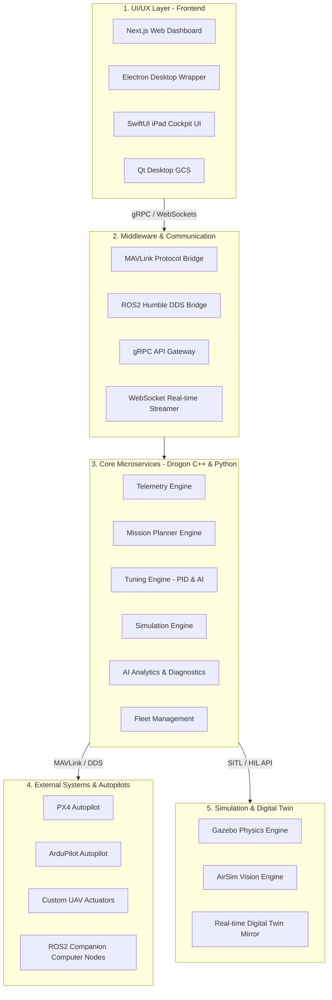

# Unified Autonomy Operating Platform (UAOP)
## 🛸 Master Architecture & Developer Onboarding Guide

Welcome to the **Unified Autonomy Operating Platform (UAOP)** repository. This document serves as the primary source of truth for the platform's vision, system architecture, tech stack, progress tracking, development roadmap, and regulatory compliance frameworks. 

Use this guide for onboarding new developers, aligning engineering teams, or presenting the technical blueprint to stakeholders and certification authorities.

---

## 📖 1. Project Vision & Executive Summary

### The Problem
The current unmanned aerial vehicle (UAV) and robotics software ecosystem is highly fragmented:
* **Autopilot Firmware** (e.g., PX4, ArduPilot) runs onboard the aircraft, handling raw control loops and sensor fusion.
* **Ground Control Stations (GCS)** (e.g., QGroundControl, Mission Planner) run on laptops/tablets for flight monitoring and parameter configuration, but lack native integration with high-level robotic middlewares.
* **Robotics Middleware** (e.g., ROS2) runs on companion computers for computer vision, AI, and swarm logic, but operates in a separate execution space from the autopilot and GCS.
* **Simulators** (e.g., Gazebo, AirSim) and **Enterprise Fleet Managers** are run as isolated desktop tools or proprietary cloud applications.

Engineers are forced to stitch these components together using custom scripts, leading to brittle integrations, massive data latency, and software that is impossible to qualify for safety-critical aviation certifications.

### The Solution: UAOP
**UAOP** unifies these fragmented layers into a single, modular, high-performance, and certifiable operating platform. It replaces standalone GCS tools, separated ROS visualizations, and disconnected simulators with a unified workspace, standardizing real-time telemetry, advanced AI-driven control tuning, digital twin simulation, and multi-vehicle swarm coordination.

```
       [ DEFENSE & ENTERPRISE APPLICATIONS ]
                        │
┌───────────────────────▼───────────────────────┐
│                     UAOP                      │
│   ┌───────────────────────────────────────┐   │
│   │           Unified Frontend            │   │
│   │   (Web Dashboard / Qt GCS / iPad)     │   │
│   └───────────────────┬───────────────────┘   │
│   ┌───────────────────▼───────────────────┐   │
│   │    Middleware (ROS2 DDS / MAVLink)    │   │
│   └───────────────────┬───────────────────┘   │
│   ┌───────────────────▼───────────────────┐   │
│   │      Core Microservices & Engines     │   │
│   │  (Telemetry, Tuning, Simulation, AI)  │   │
│   └───────────────────────────────────────┘   │
└───────────────────────┬───────────────────────┘
                        │
        [ PX4 / ArduPilot / Custom UAVs ]
```

### Market Positioning
UAOP is positioned as **"The Unreal Engine of Autonomy Systems."** It provides drone developers, aerospace corporations, defense agencies, and flight training academies with a robust, open, yet fully certifiable software infrastructure to run missions, tune control systems, and manage fleets.

---

## 🏗️ 2. System Architecture

UAOP is designed around a **layered, microservices-based, and edge-capable architecture** to guarantee high reliability, low-latency telemetry processing, and compliance with aviation safety standards.

### Layered Architecture Breakdown



1. **UI/UX Layer**: Delivers cross-platform visualization. The Next.js dashboard provides high-level web fleet controls; Electron packages this for offline desktop fields; SwiftUI provides low-latency iPad flight instruments; and Qt GCS provides raw, deterministic telemetry.
2. **Middleware & Communication Layer**: Adapts and routes binary streams. MAVLink is used for low-bandwidth telemetry to the autopilot, ROS2 DDS for high-bandwidth companion data, gRPC for service requests, and WebSockets for pushing real-time graphs to the UI.
3. **Core Services Layer**: Microservices written in C++ (using the high-performance Drogon framework) for telemetry processing, mission compilation, and tuning; and in Python for AI model inference and ROS2 interface logic.
4. **Vehicle Layer**: The actual hardware systems or SITL instances running flight controller firmware and edge nodes.
5. **Simulation Layer**: Provides physics and visual rendering engines for hardware-in-the-loop (HIL) and software-in-the-loop (SITL) validation.

---

## 🛠️ 3. Technology Stack & Standards Matrix

| Component | Technology | Target Version / Standard | Purpose |
| :--- | :--- | :--- | :--- |
| **Frontend Web** | Next.js / React | Next.js 14+ / React 18+ | Main web configuration dashboard, mapping, and parameter interfaces. |
| **Frontend Desktop** | Electron | latest stable | Offline cross-platform ground control app wrapper. |
| **Frontend Mobile** | SwiftUI | iOS 17+ | iPad cockpit-style primary flight display (PFD) and flight trainer. |
| **Frontend Legacy** | C++ Qt | Qt 5.15.2 | High-performance, low-latency backup telemetry viewer. |
| **Core Backend** | C++ (Drogon) | C++20 / Drogon v1.9+ | Real-time telemetry ingestion, mission validation, and parameter tuning engine. |
| **AI & ROS Service** | Python | Python 3.10+ | Anomaly detection, PID autotuning optimization, and ROS2 workspace bridge. |
| **Robotics OS** | ROS2 Humble | Humble Hawksbill | DDS middleware, topic monitoring, and companion computer communications. |
| **Autopilot Protocols**| MAVLink | MAVLink v2.0 | Protocol for communicating with PX4 and ArduPilot autopilots. |
| **Databases** | PostgreSQL / Redis | PG 15 / Redis 7 | Persistent metadata storage (PostgreSQL) and real-time telemetry caching (Redis). |
| **Simulation** | Gazebo / AirSim | Gazebo Harmonic / AirSim v1.8 | Gazebo for multi-vehicle physics; AirSim for photo-realistic sensor & YOLO training. |
| **Infrastructure** | Docker / Kubernetes | Docker v24 / K8s v1.28 | Containerized deployments for core services at the edge or cloud. |
| **Monitoring** | Prometheus / Grafana| latest stable | Time-series metrics collection and system latency dashboards. |

---

## 📈 4. What Has Been Done (Current Project State)

The workspace has been organized and cleaned to provide a professional, unified development environment:

1. **Unified Workspace Consolidation**: The project has been refactored to remove duplicate nested backups. All folders reside in a flat, clean, corporate-ready repository.
2. **Scaffolded Codebase Architecture**:
   * `frontend/web-dashboard/`: Next.js workspace setup for main operational dashboard.
   * `frontend/ui-nextjs/`: Specialized Next.js workspace using **Cesium**, **MapLibre GL**, **Zustand**, and **Roslib** for 3D terrain flight visualization and ROS2 node interaction.
   * `frontend/qt-desktop-gcs/`: C++ Qt structure for low-latency desktop ground station.
   * `backend/services/`: Services organized into individual subdirectories (telemetry-engine, mission-engine, compliance-engine, ai-engine, etc.).
   * `external/`: Real clones of **ArduPilot** and **QGroundControl** have been pulled and set up as external modules for testing and integration.
3. **Compliance & Settings Setup**:
   * Root level `.cursorrules` and `.windsurfrules` configure AI assistants to write MISRA-compliant code, follow strict API patterns, and respect system constraints.
   * `.claude/settings.json` is set up with automated hooks linking the workspace to the `code-review-graph` analyzer, auditing files line-by-line for bugs.
   * `docs/compliance.md` and `docs/progress.md` have been established to track active regulatory certifications and sub-repository integrations.

---

## 📅 5. The 4-Phase Implementation Roadmap

To ensure high-quality delivery, UAOP development is split into four distinct phases, each gated by functional, system-level, and compliance verification checkmarks.

---

### 🚀 Phase 1: Core Platform & GCS Foundation
**Objective**: Build a production-grade, certifiable foundation that replaces QGroundControl baseline telemetry, establishing a DO-178C-compliant architecture.

#### Key Focus Areas
* **Telemetry Engine**: MAVLink binary parser, buffering, and real-time streaming via WebSockets.
* **Mission Planner**: Waypoint creation, XML/JSON route uploads, and geofencing.
* **Parameter System**: MAVLink parameter tree parsing with read/write capability and audit logging.
* **Connection Manager**: Connection tracking over UDP, TCP, and Serial with vehicle heartbeats.

```
                  ┌───────────────────────┐
                  │   MAVLink Ingestion   │
                  └───────────┬───────────┘
                              │ (Binary Stream)
                              ▼
                  ┌───────────────────────┐
                  │   Telemetry Engine    │
                  └───────────┬───────────┘
                              │ (JSON / WebSockets)
                              ▼
                  ┌───────────────────────┐
                  │ Next.js Web Dashboard │
                  └───────────────────────┘
```

#### Verification Checklist
- [ ] Connect the Telemetry Engine to a running PX4 SITL instance via UDP.
- [ ] Verify telemetry parameters (Altitude, Roll/Pitch/Yaw, GPS coordinates) update in the Next.js UI at 50Hz with latency $< 20\text{ms}$.
- [ ] Upload a waypoint mission from the GCS UI, and verify the waypoint list matches the values read back from the autopilot.
- [ ] Verify that lost-link (telemetry timeout $> 3\text{s}$) triggers the connection manager's safety state.
- [ ] Generate the initial Requirements Traceability Matrix (RTM) matching HLRs to code modules.

---

### 🛠️ Phase 2: Advanced Tuning & ROS2 Integration
**Objective**: Transform the platform into an autonomy development system by adding deep control loop tuning interfaces and native ROS2 DDS communications.

#### Key Focus Areas
* **Advanced Tuning Engine**: Graphical PID slider interface, real-time frequency response analysis, and oscillation detectors.
* **ROS2 Humble Bridge**: Native DDS bridge to discover topics, publish services, and call ROS actions directly from the web dashboard.
* **Introspection Dashboard**: CPU/memory profiling of companion computers and topic bandwidth monitors.
* **AI Diagnostics**: Python-based flight log parser designed to detect control instability.

```
    ┌─────────────┐             ┌─────────────┐
    │  MAVLink    │             │  ROS2 DDS   │
    │  Telemetry  │             │  Robotics   │
    └──────┬──────┘             └──────┬──────┘
           │                           │
           └─────────────┬─────────────┘
                         ▼
             ┌───────────────────────┐
             │ Unified Telemetry     │
             │ Synchronizer          │
             └───────────┬───────────┘
                         ▼
             ┌───────────────────────┐
             │ Tuning Engine (C++)   │
             │ & AI Diagnostic (Py)  │
             └───────────────────────┘
```

#### Verification Checklist
- [ ] Initialize ROS2 nodes and verify they show up in the web-based Topic Introspection Dashboard.
- [ ] Stream high-rate data from a ROS2 topic (e.g., camera feeds or laser scans) alongside MAVLink telemetry without thread blocking.
- [ ] Change a PID parameter on a simulated drone through the graphical slider, and log the parameter update timestamp in the audit database.
- [ ] Verify that artificial oscillations injected in SITL are flagged by the Python AI diagnostic model within 500ms of occurrence.

---

### 🎨 Phase 3: Simulation, Digital Twin, & AI Analytics
**Objective**: Build out the simulation engine (Gazebo/AirSim), integrate real-time digital twin rendering, and run failure-injection tests.

#### Key Focus Areas
* **Simulation Engine**: SITL orchestration for PX4/ArduPilot inside Gazebo and AirSim.
* **Digital Twin**: A 3D WebGL renderer reflecting the physical/simulated drone state in real-time.
* **AI Flight Scoring**: Algorithms to score flight paths against planned routes, grading pilot performance or autopilot tracking.
* **Failure Injection Framework**: API to programmatically trigger sensor malfunctions, motor failures, and signal jamming.

```
       ┌───────────────────┐           ┌───────────────────┐
       │   Physical UAV    │           │   Simulated UAV   │
       │   (Real Flight)   │           │   (Gazebo/SITL)   │
       └─────────┬─────────┘           └─────────┬─────────┘
                 │ (State Telemetry)             │ (Sim Telemetry)
                 └───────────────┬───────────────┘
                                 ▼
                       ┌───────────────────┐
                       │   Digital Twin    │
                       │   Mirrored UI     │
                       └───────────────────┘
```

#### Verification Checklist
- [ ] Run a simulated flight in Gazebo, and verify the Digital Twin dashboard mirrors the drone's position in 3D space with zero visual stuttering.
- [ ] Trigger a simulated GPS fail-safe through the failure injection API, and verify the autopilot successfully switches to Altitude Hold or RTL mode.
- [ ] Run an automated scenario build (e.g., adding wind gusts) and extract the flight scoring report showing path deviations.
- [ ] Run HIL (Hardware-In-The-Loop) tests connecting a physical Pixhawk autopilot board to the simulation engine.

---

### 🏢 Phase 4: Enterprise Fleet, SDK, & Certification
**Objective**: Scale the platform to support swarm operations, cloud deployment (Kubernetes), plugin architectures, and DO-178C software audits.

#### Key Focus Areas
* **Fleet Dashboard**: Multi-UAV management interface with active route status and geofencing.
* **Plugin SDK**: Standardized APIs for C++ and Python developers to write custom flight rules, sensor plugins, or GCS widgets.
* **Aviation Certification**: Automatic generator for structural coverage reports, test logs, and requirement baselines.
* **Cloud Infrastructure**: Kubernetes Helm charts, Prometheus metrics collection, and Grafana dashboards for cloud-based fleet operations.

#### Verification Checklist
- [ ] Connect 10 simulated drone nodes to the Fleet Dashboard simultaneously and verify individual telemetry updates.
- [ ] Compile and load a custom third-party sensor widget using the Plugin SDK API.
- [ ] Verify OAuth2 role-based access limits flight authorization commands to users with "Pilot-in-Command" permissions.
- [ ] Generate a complete DO-178C compliance binder including the RTM and coverage logs.

---

## ✈️ 6. Aviation & Regulatory Compliance Framework

Developing software that controls flying aircraft requires strict adherence to international safety standards. UAOP is designed from the ground up to be certifiable.

### DO-178C (Software Considerations in Airborne Systems)
UAOP software modules targeting flight controller interfaces or safety-critical functions must follow DO-178C **DAL B or C** guidelines:
1. **Bidirectional Requirements Traceability**:
   Each high-level system requirement (HLR) must trace to one or more low-level software requirements (LLR), which in turn trace to specific source code lines and test cases. No code may exist in safety-critical directories without a parent requirement.
2. **Structural Coverage Analysis**:
   Unit testing pipelines must measure structural coverage. Under DAL C, **Statement Coverage** is required; under DAL B, **Decision Coverage** and **Modified Condition/Decision Coverage (MC/DC)** are enforced.
3. **Tool Qualification (DO-330)**:
   Any automated tool (e.g., parameter verification scripts or auto-testers) used to verify safety-critical code must undergo a qualification process to ensure its outputs are reliable.

### MISRA C++ Coding Standards
Core C++ services (such as the Telemetry and Tuning engines) must adhere to **MISRA C++:2023** (or MISRA C++:2008) guidelines:
* **No Dynamic Memory Allocation**: Standard heap allocation (`malloc`, `new`) is forbidden during flight runtime to prevent memory leaks and unpredictable garbage collection pauses. Static buffers and pool allocation are enforced.
* **Strict Exception Handling**: C++ exceptions must be avoided or strictly controlled.
* **No Undefined Behavior**: Strict static analyzers (e.g., Coverity, Clang-Tidy) are run on every pull request to catch violations.

### Operational Regulations
The platform integrates regulatory frameworks directly into the code logic:
* **FAA Part 107 (United States)**: The mission planner automatically warns when waypoint altitudes exceed **400ft AGL** or routes cross restricted airspace without an active waiver.
* **DGCA NPNT (No Permission, No Takeoff - India)**: The vehicle arming sequence executes a cryptographic check, sending a flight envelope signature to the DGCA server. Arming is blocked unless a digital permission artifact is returned.
* **EASA SORA (Specific Operations Risk Assessment - Europe)**: The mission planner guides operators through the SORA questionnaire, calculating the Ground Risk Class (GRC) and Air Risk Class (ARC) before flight plans can be submitted.
* **ASTM F3322 (UAS Parachutes)**: Autopilot nodes listen to altitude loss and extreme attitude angles ($>70^\circ$ roll/pitch). If unrecoverable flight behavior is detected, it triggers a hardware command to cut motor power and deploy the parachute.

---

## 🚀 7. Developer Onboarding & Local Setup

Get your local UAOP development environment running in minutes.

### 1. Prerequisites
Ensure your machine meets the following requirements:
* **Operating System**: Ubuntu 22.04 LTS (native or via WSL2 on Windows).
* **Docker & Docker Compose**: installed and configured.
* **Qt 5.15.2**: Required if you plan to compile the C++ `frontend/qt-desktop-gcs`.
* **Python 3.10+** and **Node.js 18+**.

### 2. Initializing the Repository
To clone the repository and sync all external submodules (including PX4 and ArduPilot submodules):
```bash
# Clone the repository
git clone https://github.com/Praddyx15/UAOP.git
cd UAOP

# Sync and update submodules recursively (takes time due to autopilot sizes)
git submodule update --init --recursive
```

### 3. Running the Next.js Frontend
To start the developer instance of the main Next.js UI Dashboard:
```bash
# Navigate to the dashboard folder
cd frontend/web-dashboard

# Install dependencies and start the dev server
npm install
npm run dev
```
Open [http://localhost:3000](http://localhost:3000) in your browser to view the interface.

### 4. Running the Cesium 3D Map UI
To start the mapping and ROS client UI:
```bash
# Navigate to the ui folder
cd frontend/ui-nextjs

# Install dependencies and start the dev server
npm install
npm run dev
```
Open [http://localhost:3001](http://localhost:3001) in your browser.

### 5. Running the Drogon C++ Backend (Docker)
We package the Drogon C++ microservices and PostgreSQL/Redis instances inside Docker Compose for easy local development:
```bash
# From the root directory, spin up all backend containers
docker-compose up --build
```
This starts:
* **`postgres`** database on port `5432`
* **`redis`** cache on port `6379`
* **`uaop-backend`** core C++ services on port `8080` (gRPC and WebSockets)

---

## 🤝 8. Contribution Standards

To maintain a clean and certifiable codebase, all contributions must adhere to the following rules:

1. **Feature Branches**: Create branches using the convention `feature/issue-[id]-short-description` or `bugfix/issue-[id]-short-description`.
2. **Conventional Commits**: Commit messages must follow the standard format:
   `type(scope): message [issue-id]` (e.g., `feat(telemetry): add MAVLink 2.0 parser [issue-102]`).
3. **No Dynamic Allocation**: Core flight-critical C++ code must not call `new` or `malloc`. Use pre-allocated static pools or stack allocation.
4. **Code Audits**: Every pull request must pass the automated CI/CD pipeline, which runs `clang-format`, `eslint`, and tests, as well as a MISRA C++ check.
